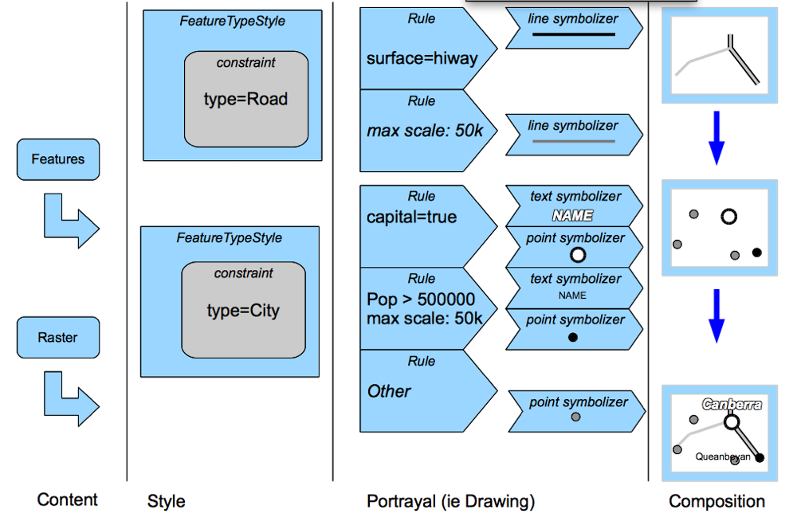

:Author: Jody Garnett
:Author: Micheal Bedward
:Thanks: geotools-user list
:Version: |release|
:License: Create Commons with attribution

.. include:: <isonum.txt>

.. _style:

*********************
 Map Style Tutorial
*********************

.. contents::

Style is all about looking good. In this lab we are going to learn the basics of how to make good looking maps.

Style
======
 
Please ensure your pom.xml includes the following::

    <properties>
        <geotools.version>2.7-M2</geotools.version>
    </properties>

    <dependencies>
        <dependency>
            <groupId>org.geotools</groupId>
            <artifactId>gt-shapefile</artifactId>
            <version>${geotools.version}</version>
        </dependency>
        <dependency>
            <groupId>org.geotools</groupId>
            <artifactId>gt-epsg-hsql</artifactId>
            <version>${geotools.version}</version>
        </dependency>
        <dependency>
            <groupId>org.geotools</groupId>
            <artifactId>gt-swing</artifactId>
            <version>${geotools.version}</version>
        </dependency>
    </dependencies>

Example
-------

The example code is available
 * Directly from svn: StyleLab.java_
 * Included in the demo directory when you download the GeoTools source code

.. _StyleLab.java: http://svn.osgeo.org/geotools/tags/2.6.4/demo/example/src/main/java/org/geotools/demo/StyleLab.java 

Main Application
----------------
1. Please create the file **StyleLab.java**
2. Copy and paste in the following code:

   .. literalinclude:: ../../src/main/java/org/geotools/tutorial/style/StyleLab.java
      :language: java
      :start-after: // docs start source
      :end-before: // docs end main

Displaying a shapefile
----------------------

If you have worked through the previous labs, most of this method will look familiar to you:

   .. literalinclude:: ../../src/main/java/org/geotools/tutorial/style/StyleLab.java
      :language: java
      :start-after: // docs start display
      :end-before: // docs end display

The main thing to note is that we are calling a **createStyle** method to set a Style for the map layer.
Let's look at this method next.

Creating a style
----------------

This method first looks to see if there is an SLD document (Styled Layer Descriptor) associated with the shapefile.
If it finds one it processes that file to create the style. Otherwise, it displays a **JSimpleStyleDialog** to
prompt the user for style choices:

   .. literalinclude:: ../../src/main/java/org/geotools/tutorial/style/StyleLab.java
      :language: java
      :start-after: // docs start create style
      :end-before: // docs end create style

The following two methods do the work of figuring out the SLD file name, based on the shapefile name, and processing
the SLD document if one is found:

   .. literalinclude:: ../../src/main/java/org/geotools/tutorial/style/StyleLab.java
      :language: java
      :start-after: // docs start sld
      :end-before: // docs end sld

Creating styles By Hand
------------------------

The methods that we've looked at so far are all we really need in this simple application. But now let's look at how to create a style programmatically.
This illustrates some of what is happening behind the scenes in the previous code. It also introduces you to **StyleFactory** and **FilterFactory** 
which provide a huge amount of flexibility in the styles that you can create.

In the code below, the first method works out what type of geometry we have in our shapefile: points, lines or polygons. It then calls a geometry-specific
method to create a Style object.

.. literalinclude:: ../../src/main/java/org/geotools/tutorial/style/StyleLab.java
   :language: java
   :start-after: // docs start alternative
   :end-before: // docs end alternative

Things to note:

* Each of the geometry specific methods is creating a type of **Symbolizer**: the class that controls how features are rendered
* Each method wraps the symbolizer in a **Rule**, then a **FeatureTypeStyle**, and finally a **Style**
* In real life, it is common to have more than one Rule in a FeatureTypeStyle. For example, we might create one rule to draw features when the 
  map is zoomed out, and another for when we are displaying fine details.

Selection
==========

This tutorial brings together many of the techniques and classes that we've covered in the previous
examples. It is best if you have already worked through at least the quickstart, csv2shp and style
tutorials.

We are going to:

 * Create a custom map cursor tool to select features when the user clicks the map
 * Add a toolbar button to JMapFrame to launch this tool
 * Use a Filter to find which features were under, or near the mouse click
 * Create rendering styles to draw selected and unselected features in different colours

Dependencies
------------
 
Please ensure your pom.xml includes the following::

  <properties>
      <geotools.version>2.7-SNAPSHOT</geotools.version>
  </properties>

  <dependencies>
      <dependency>
          <groupId>org.geotools</groupId>
          <artifactId>gt-shapefile</artifactId>
          <version>${geotools.version}</version>
      </dependency>
      <dependency>
          <groupId>org.geotools</groupId>
          <artifactId>gt-epsg-hsql</artifactId>
          <version>${geotools.version}</version>
      </dependency>
      <dependency>
          <groupId>org.geotools</groupId>
          <artifactId>gt-swing</artifactId>
          <version>${geotools.version}</version>
      </dependency>
  </dependencies>

Example
-------

The example code is available
 * Directly from svn: SelectionLab.java_
 * Included in the demo directory when you download the GeoTools source code

.. _SelectionLab.java: http://svn.osgeo.org/geotools/trunk/demo/example/src/main/java/org/geotools/demo/SelectionLab.java
 
Main Application
----------------
1. Please create the file **SelectionLab.java**
2. Copy and paste in the following code:

   .. literalinclude:: ../../src/main/java/org/geotools/tutorial/style/SelectionLab.java
      :language: java
      :start-after: // docs start source
      :end-before: // docs end main

Much of this should look familiar to you from the style tutorial. We've added some constants and
class variables that we'll use when creating styles. 

A subtle difference is that we are now using FilterFactory2 instead of FilterFactory. This class
adds additional methods, one of which we'll need when selecting features based on a mouse click.

Shapefile viewer with custom map tool
-------------------------------------

Next we add the displayShapefile method which is also very similar to the one that we used in
style tutorial.

.. literalinclude:: ../../src/main/java/org/geotools/tutorial/style/SelectionLab.java
   :language: java
   :start-after: // docs start display shapefile
   :end-before: // docs end display shapefile

Note that we are customizing the JMapFrame by adding a button to its toolbar. When the user clicks this button a new
**CursorTool** is set for the map window.  This tool has just one method that responds to a mouse click in the map area.

What features did the user click on ?
-------------------------------------

Next we'll add the method that is called when the user is in selection mode (our custom toolbar button has been clicked)
and has clicked somewhere on the map.

The method first creates a 5x5 pixel wide rectangle around the mouse position to make it easier to select point and line
features. This is transformed from pixel coordinates to world coordinates and used to create a Filter to identify
features under, or close to, the mouse click.

   .. literalinclude:: ../../src/main/java/org/geotools/tutorial/style/SelectionLab.java
      :language: java
      :start-after: // docs start select features
      :end-before: // docs end select features

Note that we are using an *intersects* filter and not a *bbox* (bounding box) filter in this method.  A bounding box
filter is very fast, but it would only test if the rectangle around the mouse click is within the **envelope**, as
opposed to the **boundary**, of each feature. For this application, that's not what we want to do. To see why, consider
this example...

.. image:: images/selectionlab-bbox.png

The blue shapes are parts of a single MultiPolygon which is the standard geometry type for polygonal features in
shapefiles. Using a bounding box filter, clicking in the orange shape would select it plus all of the blue shapes
because the click region is within their envelope (the grey rectangle).

Creating a Style based on the selection
---------------------------------------

Once the method above has worked out which features were selected, if any, it passes their FeatureIds to the
**displaySelected** method.  This simply calls one of two Style creating methods and then redisplays the map with the
updated Style:

   .. literalinclude:: ../../src/main/java/org/geotools/tutorial/style/SelectionLab.java
      :language: java
      :start-after: // docs start display selected
      :end-before: // docs end display selected

The default style
~~~~~~~~~~~~~~~~~

This method creates a Style with a single **Rule** for all features using the line and fill constants defined at the top
of the class:

   .. literalinclude:: ../../src/main/java/org/geotools/tutorial/style/SelectionLab.java
      :language: java
      :start-after: // docs start default style
      :end-before: // docs end default style

The selected style
~~~~~~~~~~~~~~~~~~

This method creates a Style with one **Rule** for selected features, to paint them in a
highlight colour, and a second **Rule** for unselected features. Both rules are then wrapped in the Style object.

   .. literalinclude:: ../../src/main/java/org/geotools/tutorial/style/SelectionLab.java
      :language: java
      :start-after: // docs start selected style
      :end-before: // docs end selected style

Note that the first Rule includes a **Filter**, created with the **FilterFactory2.id** method. This means the rule will
only apply to the selected features.

The second rule is flagged as an *alternative* (applies to all other features) with the **setElseFilter** method.

Creating a Rule and Symbolizer
~~~~~~~~~~~~~~~~~~~~~~~~~~~~~~

OK, we're nearly at the end !

Here is the method **createRule**. This is where the **Symbolizer** is created that describes how to draw a feature.

   .. literalinclude:: ../../src/main/java/org/geotools/tutorial/style/SelectionLab.java
      :language: java
      :start-after: // docs start create rule
      :end-before: // docs end create rule

Geometry type of the shapefile features
---------------------------------------

Finally (yes, really) the createRule method above needs to know what sort of feature geometry we are dealing with to
create the appropriate class of Symbolizer. Here is the method that works that out:

   .. literalinclude:: ../../src/main/java/org/geotools/tutorial/style/SelectionLab.java
      :language: java
      :start-after: // docs start set geometry
      :end-before: // docs end set geometry

Running the application
-----------------------

Here is the program displaying the **bc_voting_areas** shapefile (included in the `uDig sample data`__) with one feature
(polygon) selected:

.. _udigdata: http://udig.refractions.net/docs/data-v1_2.zip

__ udigdata_

.. image:: images/SelectionLab.png

Things to try
==============

In Geometry and CRS tutorial we saw how to change the Coordinate Reference System of a MapContext.
Try the following:

* Modify this application so that you can change the CRS in which the features are displayed.
* Display the **bc_voting_areas** shapefile and change the CRS to EPSG:4326
* Now try to use the selection tool. You will find that it no longer works !

See if you can you figure out why the tool isn't working and how to fix it.

There is actually some amazing style generation code included with GeoTools. Add a dependency
on the **gt-brewer** module and having a look at the **ColorBrewer class**.
 
The class works by first asking you to calculate a *categorization* using one of the categorization
functions on a feature collection; you can then pass the resulting categorization on to color brewer
and it will generate a style for you based predefined palettes.

For more information visit: http://colorbrewer2.org/ 

Style Layer Descriptor
======================

Style is all about looking good, and this section is a box of crayons, learning how to make a map
look good is the practice of cartography.

Actually cartography is focused on using a map to communicate, choosing what information to include,
being strict about removing information that is off topic and so on.

Occasionally organizations will have *cartographic standards* that must be followed. How thick lines
must be exactly, what shade of blue to use for water.  Having a cartographic standard is a great
time saver |hyphen| the rest of us are going to have to be creative.

We do have one kind of standard to help us though: the Styled Layer Descriptor (SLD) standard
|hyphen| this document defines a nice data structure for Style which we have captured in the form
of Java objects. If you get stuck at any point please review the SLD specification as it defines
all the ideas we are going to work with today.

At its heart it focuses on two things:

Style Layer Descriptor
  Covers the definition of |ldquo| layers |rdquo| or presentations of feature content.

Symbology Encoding
  Covers portrayal or how to draw the features
  
Controlling the Rendering Process
---------------------------------

This is the heart of map making with GeoTools (or indeed with open standards).

It helps if you imagine a big funnel throwing all the features at your map at once. This is going
to work kind of like those machines for sorting coins |hyphen| early stages of the machine are going to
select a feature; once we are sure what kind of feature we have we are going to use the feature to
control actual drawing onto different bitmaps. Finally we will gather up all the different bitmaps
(and slap some labels on top) to produce a final image.

Rendering occurs in the following stages:

* Content Selection: selecting and filtering 
* Portrayal: actual drawing
* Composition: putting everything together

The first line of defence is |ldquo| FeatureTypeStyle |rdquo|, it makes use of a constraint to select what
FeatureType you want to work with. If you don't care use the FeatureType with the name `Feature`
as kind of a wild card (since everything extends `Feature`). 

Next up we have Rules. Rules actually use Filter (from the Filter tutorial) to perform strict
checks about what is going to get drawn. In addition to checking feature attributes with Filter,
a Rule is able to check the current scale of the map. Finally there is an `Other` rule to catch any
features left over from earlier Rules.

Now that a Rule has selected features for us to work with we can get down to drawing in the
Portrayal step. The renderer will go through a list of symbolizers (for a Rule) and draw the
results. The symbolizers are just a list of draw instructions to be done in order. The symbolizers
use expressions to define width and color |hyphen| allowing you to dynamically generate the
appearance on a feature by feature basis!

The only symbolizer which is not drawn in order is TextSymbolizer which gathers up text labels for 
the next step.

Finally in the composition step |hyphen| will take all the content drawn during portrayal and squish
them together into a final image. The icing on the cake is the text labels (produced from any and
all TextSymbolizers) which are drizzled on top taking care not to have any overlaps.
