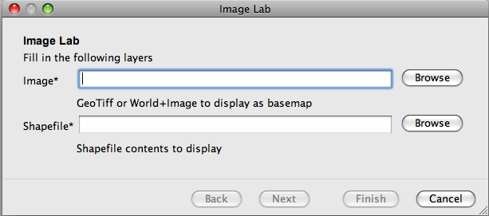
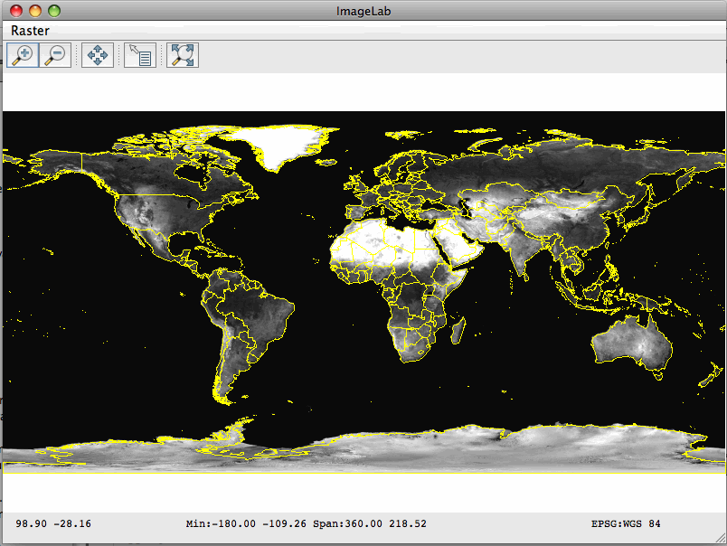

.. _imagelab:

Image Lab
===========

In the earlier examples we looked at reading and displaying shapefiles. Now we are going add raster (ie. gridded data)
maps to the mix by displaying a three-band global satellite image and overlaying it with country boundaries from a
shapefile.

Dependencies
------------
 
Please ensure your pom.xml includes the following::

    <properties>
        <geotools.version>2.7-SNAPSHOT</geotools.version>
    </properties>

    <dependencies>
        <dependency>
            <groupId>org.geotools</groupId>
            <artifactId>gt-swing</artifactId>
            <version>${geotools.version}</version>
        </dependency>
        <dependency>
            <groupId>org.geotools</groupId>
            <artifactId>gt-render</artifactId>
            <version>${geotools.version}</version>
        </dependency>
        <dependency>
            <groupId>org.geotools</groupId>
            <artifactId>gt-epsg-hsql</artifactId>
            <version>${geotools.version}</version>
        </dependency>
        <dependency>
            <groupId>org.geotools</groupId>
            <artifactId>gt-shapefile</artifactId>
            <version>${geotools.version}</version>
        </dependency>
        <dependency>
            <groupId>org.geotools</groupId>
            <artifactId>gt-coverage</artifactId>
            <version>${geotools.version}</version>
        </dependency>
        <dependency>
            <groupId>org.geotools</groupId>
            <artifactId>gt-geotiff</artifactId>
            <version>${geotools.version}</version>
        </dependency>
        <dependency>
            <groupId>org.geotools</groupId>
            <artifactId>gt-image</artifactId>
            <version>${geotools.version}</version>
        </dependency>
    </dependencies>

Most of these dependencies in the earlier examples such as :ref:`quickstart` and :ref:`crslab`. The modules that we've
added are **gt-geotiff** which allows us to read raster map data from a GeoTIFF file and **gt-image** which allows us to
read an Image+World format file set (e.g. jpg + jpw) and **gt-coverage** for working with raster coverages.
 
Example
-------

The example code is available
 * Directly from svn: ImageLab.java_
 * Included in the demo directory when you download the GeoTools source code

.. _ImageLab.java: http://svn.osgeo.org/geotools/trunk/demo/example/src/main/java/org/geotools/demo/ImageLab.java 

Main Application
----------------
1. Please create the file **ImageLab.java**
2. Copy and paste in the following code:

   .. literalinclude:: ../../../demo/example/src/main/java/org/geotools/demo/ImageLab.java
      :language: java
      :start-after: // docs start source
      :end-before: // docs end main

Prompting for input data
------------------------

We use one of GeoTools' data wizards, **JParameterListWizard**, to prompt for the raster file and the shapefile that
will be displayed over it:

   .. literalinclude:: ../../../demo/example/src/main/java/org/geotools/demo/ImageLab.java
      :language: java
      :start-after: // docs start get layers
      :end-before: // docs end get layers

Note the use of **Parameter** objects for each input file. The arguments passed to the Parameter constructor are:

:key: an identifier for the Parameter

:type: the class of the object that the Parameter refers to

:title: a title which the wizard will use to label the text field

:description: a brief description which the wizard will display below the text field

:metadata: a Map containing additional data for the Parameter - in our case this is one or more file extensions.

**KVP** is a handy class for creating a Map of String:Object pairs:: 

  // rather than doing this...
  Map<String, Object> map = new HashMap<String, Object>
  map.add(Parameter.EXT, "jpg");
  map.add(Parameter.EXT, "tif");

  // we can just say...
  KVP map = new KVP(Parameter.EXT, "jpg", Parameter.EXT, "tif");

Displaying the map
------------------

To display the map on screen we create a **MapContext**, add the image and the shapefile to it, and pass it
to a **JMapFrame**. 

Rather than using the static JMapFrame.showMap method, as we have in previous examples, we create a map frame and customize it
by adding a menu to choose the image display mode. 

   .. literalinclude:: ../../../demo/example/src/main/java/org/geotools/demo/ImageLab.java
      :language: java
      :start-after: // docs start display layers
      :end-before: // docs end display layers

Note that we are creating a **Style** for each of the map layers...

* A greyscale Style for the initial image display, created with a method that we'll examine next
* A simple outline style for the shapefile using the **SLD** utility class

Creating a Style for the raster layer
-------------------------------------

We want the user to be able to choose between greyscale display of a selected image band, or RGB display
(assuming that the image contains at least three bands).

Creating a greyscale Style
~~~~~~~~~~~~~~~~~~~~~~~~~~

Two methods are involved here: 

 * **createGreyScaleStyle()**, prompts the user for the image band to display
 * **createGreyScaleStyle(int band)** does the actual work of creating a new Style object

   .. literalinclude:: ../../../demo/example/src/main/java/org/geotools/demo/ImageLab.java
      :language: java
      :start-after: // docs start create greyscale style
      :end-before: // docs end create greyscale style

Creating an RGB Style
~~~~~~~~~~~~~~~~~~~~~

To create an RGB Style we specify the image bands to use for the red, green and blue *channels*. In the method here,
we examine the image to see if its bands (known as *sample dimensions* in GeoTools-speak) have labels indicating which
to use. If not, we just use the first three bands and hope for the best !

   .. literalinclude:: ../../../demo/example/src/main/java/org/geotools/demo/ImageLab.java
      :language: java
      :start-after: // docs start create rgb style
      :end-before: // docs end source

Running the application
-----------------------

If you need some sample data to display you can download the uDig sample dataset from
http://udig.refractions.net/docs/data-v1_2.zip which contains a geotiff global image: **bluemarble.tif** and a shapefile
of country borders: **countries.shp**

When you run the program you will first see the wizard dialog prompting your for the image and shapefile...

The initial map display shows the image as a greyscale, single-band view...

Experiment with displaying different bands in greyscale and swapping to the RGB display.

Extra things to try
-------------------

* Modify the file prompt wizard, or the menu, to allow additional shapfiles to be overlaid onto the
  image.

* Add a map layer table to the JMapFrame using frame.enableLayerTable(true) so that you can toggle
  the visibility of the layers.

* (Advanced) Experiment with Styles for the raster display: e.g. contrast enhancement options;
  display based on ranges of image band values

