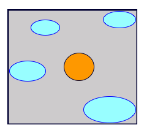
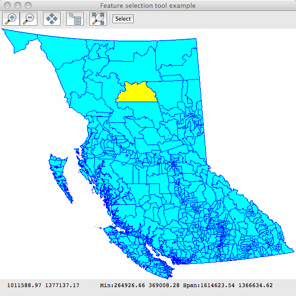

.. _selectionlab:

Selection Lab
=============

This tutorial brings together many of the techniques and classes that we've covered in the previous examples. Before
doing it, it's best if you have already worked through at least the :ref:`quickstart`, :ref:`csv2shp` and
:ref:`stylelab` examples.

We are going to:
 * Create a custom map cursor tool to select features when the user clicks the map
 * Add a toolbar button to JMapFrame to launch this tool
 * Use a Filter to find which features were under, or near the mouse click
 * Create rendering styles to draw selected and unselected features in different colours

Dependencies
------------
 
Please ensure your pom.xml includes the following::

  <properties>
      <geotools.version>2.7-SNAPSHOT</geotools.version>
  </properties>

  <dependencies>
      <dependency>
          <groupId>org.geotools</groupId>
          <artifactId>gt-shapefile</artifactId>
          <version>${geotools.version}</version>
      </dependency>
      <dependency>
          <groupId>org.geotools</groupId>
          <artifactId>gt-epsg-hsql</artifactId>
          <version>${geotools.version}</version>
      </dependency>
      <dependency>
          <groupId>org.geotools</groupId>
          <artifactId>gt-swing</artifactId>
          <version>${geotools.version}</version>
      </dependency>
  </dependencies>

Example
-------

The example code is available
 * Directly from svn: SelectionLab.java_
 * Included in the demo directory when you download the GeoTools source code

.. _SelectionLab.java: http://svn.osgeo.org/geotools/trunk/demo/example/src/main/java/org/geotools/demo/SelectionLab.java
 
Main Application
----------------
1. Please create the file **SelectionLab.java**
2. Copy and paste in the following code:

   .. literalinclude:: ../../../demo/example/src/main/java/org/geotools/demo/SelectionLab.java
      :language: java
      :start-after: // docs start source
      :end-before: // docs end main

Much of this should look familiar to you from the :ref:`stylelab`. We've added some constants and class variables that
we'll use when creating styles. 

A subtle difference is that we are now using FilterFactory2 instead of FilterFactory. This class adds additional
methods, one of which we'll need when selecting features based on a mouse click.

Shapefile viewer with custom map tool
-------------------------------------

Next we add the displayShapefile method which is also very similar to the one that we used in :ref:`stylelab`

   .. literalinclude:: ../../../demo/example/src/main/java/org/geotools/demo/SelectionLab.java
      :language: java
      :start-after: // docs start display shapefile
      :end-before: // docs end display shapefile

Note that we are customizing the JMapFrame by adding a button to its toolbar. When the user clicks this button a new
**CursorTool** is set for the map window.  This tool has just one method that responds to a mouse click in the map area.

What features did the user click on ?
-------------------------------------

Next we'll add the method that is called when the user is in selection mode (our custom toolbar button has been clicked)
and has clicked somewhere on the map.

The method first creates a 5x5 pixel wide rectangle around the mouse position to make it easier to select point and line
features. This is transformed from pixel coordinates to world coordinates and used to create a Filter to identify
features under, or close to, the mouse click.

   .. literalinclude:: ../../../demo/example/src/main/java/org/geotools/demo/SelectionLab.java
      :language: java
      :start-after: // docs start select features
      :end-before: // docs end select features

Note that we are using an *intersects* filter and not a *bbox* (bounding box) filter in this method.  A bounding box
filter is very fast, but it would only test if the rectangle around the mouse click is within the **envelope**, as
opposed to the **boundary**, of each feature. For this application, that's not what we want to do. To see why, consider
this example...

The blue shapes are parts of a single MultiPolygon which is the standard geometry type for polygonal features in
shapefiles. Using a bounding box filter, clicking in the orange shape would select it plus all of the blue shapes
because the click region is within their envelope (the grey rectangle).

Creating a Style based on the selection
---------------------------------------

Once the method above has worked out which features were selected, if any, it passes their FeatureIds to the
**displaySelected** method.  This simply calls one of two Style creating methods and then redisplays the map with the
updated Style:

   .. literalinclude:: ../../../demo/example/src/main/java/org/geotools/demo/SelectionLab.java
      :language: java
      :start-after: // docs start display selected
      :end-before: // docs end display selected

The default style
~~~~~~~~~~~~~~~~~

This method creates a Style with a single **Rule** for all features using the line and fill constants defined at the top
of the class:

   .. literalinclude:: ../../../demo/example/src/main/java/org/geotools/demo/SelectionLab.java
      :language: java
      :start-after: // docs start default style
      :end-before: // docs end default style

The selected style
~~~~~~~~~~~~~~~~~~

This method creates a Style with one **Rule** for selected features, to paint them in a
highlight colour, and a second **Rule** for unselected features. Both rules are then wrapped in the Style object.

   .. literalinclude:: ../../../demo/example/src/main/java/org/geotools/demo/SelectionLab.java
      :language: java
      :start-after: // docs start selected style
      :end-before: // docs end selected style

Note that the first Rule includes a **Filter**, created with the **FilterFactory2.id** method. This means the rule will
only apply to the selected features.

The second rule is flagged as an *alternative* (applies to all other features) with the **setElseFilter** method.

Creating a Rule and Symbolizer
~~~~~~~~~~~~~~~~~~~~~~~~~~~~~~

OK, we're nearly at the end !

Here is the method **createRule**. This is where the **Symbolizer** is created that describes how to draw a feature.

   .. literalinclude:: ../../../demo/example/src/main/java/org/geotools/demo/SelectionLab.java
      :language: java
      :start-after: // docs start create rule
      :end-before: // docs end create rule

Geometry type of the shapefile features
---------------------------------------

Finally (yes, really) the createRule method above needs to know what sort of feature geometry we are dealing with to
create the appropriate class of Symbolizer. Here is the method that works that out:

   .. literalinclude:: ../../../demo/example/src/main/java/org/geotools/demo/SelectionLab.java
      :language: java
      :start-after: // docs start set geometry
      :end-before: // docs end set geometry

Running the application
-----------------------

Here is the program displaying the **bc_voting_areas** shapefile (included in the `uDig sample data`__) with one feature
(polygon) selected:

.. _udigdata: http://udig.refractions.net/docs/data-v1_2.zip

__ udigdata_

Things to try
-------------

In :ref:`crslab` we saw how to change the Coordinate Reference System of a MapContext. Try the following:

* Modify this application so that you can change the CRS in which the features are displayed.
* Display the **bc_voting_areas** shapefile and change the CRS to EPSG:4326
* Now try to use the selection tool. You will find that it no longer works !

See if you can you figure out why the tool isn't working and how to fix it.

There is actually some amazing style generation code included with GeoTools. Try adding a dependency on the
**gt-brewer** module and having a look at the **ColorBrewer class**. The class works by first asking you to calculate a
*categorization* using one of the categorization functions on a feature collection; you can then pass the resulting
categorization on to color brewer and it will generate a style for you based predefined palettes.

For more information visit: http://colorbrewer2.org/ 

