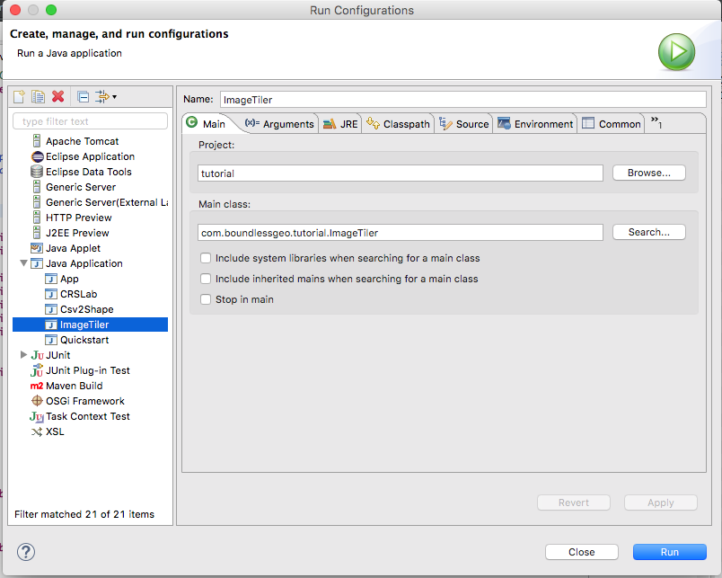
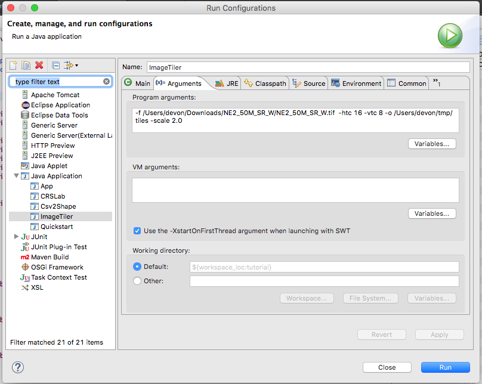

:Author: Devon Tucker
:Version: |release|
:License: Create Commons with attribution

.. include:: <isonum.txt>

***************************
Coverage Processor Tutorial
***************************

Welcome
=======

Welcome to the coverage processor tutorial. This tutorial assumes that you have followed one of the
quickstart tutorials.

Please ensure you have your IDE set up with access to the GeoTools jars (either through maven or
a directory of Jar files). The maven dependencies required will be listed at the start of the in the
pre-requisites.

This workbook introduces performing common operations -- such as multiple, resample, crop, etc. --
directly on coverage objects.

Image Tiling Application
========================

Previous tutorials covered loading and rendering coverages; this tutorial will demonstrate
performing basic operations -- such as crop and scale -- directly on a coverage using the
**CoverageProcessor** and friends, as well as use the **Arguments** tool to make command line
processing a little simpler. We will be creating a simple utility application to "tile" a coverage
(simply by subdividing the geographic envelope) and optionally scale the resulting tiles.

Pre-requisites
--------------

Many of these may already be in our pom.xml from earlier examples, but at a minimum ensure that
the following dependencies are available

.. literalinclude:: artifacts/pom.xml
    :language: xml
    :start-after: <!-- docs start deps -->
    :end-before: <!-- docs end deps -->

Create the file **ImageTiler.java** and copy and paste in the following code, which
contains our boilerplate imports, fields and getters/setters:

.. literalinclude:: /../src/main/java/org/geotools/tutorial/coverage/ImageTiler.java
    :language: java
    :start-after: //docs start prelim
    :end-before: //docs end prelim

Argument Processing
-------------------

Since we are creating a command line application, we're going to want to process command line
arguments. GeoTools includes a class named *Arguments* to facilitate this; we will use this class
to parse two mandatory arguments -- input file and output directory -- and a handful of optional
arguments -- vertical and horizontal tile counts, and tile scaling.

.. literalinclude:: /../src/main/java/org/geotools/tutorial/coverage/ImageTiler.java
    :language: java
    :start-after: //docs start main
    :end-before: //docs end main

Loading the coverage
--------------------
First we need to load the coverage; GeoTools provides **GridFormatFinder** and **AbstractGridFormat**
in order to do this abstractly. Note: there is a slight quirk with GeoTiff handling as of this
writing that we handle separately.

.. literalinclude:: /../src/main/java/org/geotools/tutorial/coverage/ImageTiler.java
    :language: java
    :start-after: //docs start load coverage
    :end-before: //docs end load coverage

Subdividing the coverage
------------------------
Next we'll subdivide the coverage based on the requested horizontal and vertical tile counts by
asking the coverage for its envelope and dividing that envelope horizontally and vertically by our tile counts.
This will give us our tile envelope width and height. Then we'll loop over our horizontal and vertical tile counts
to crop and scale.

.. literalinclude:: /../src/main/java/org/geotools/tutorial/coverage/ImageTiler.java
    :language: java
    :start-after: //docs start envelope
    :end-before: //docs end envelope

Creating our tile envelope
--------------------------
First we'll create the envelope of our tile based on our indexes and target enveloped width and height

.. literalinclude:: /../src/main/java/org/geotools/tutorial/coverage/ImageTiler.java
    :language: java
    :start-after: //docs start make envelope
    :end-before: //docs end make envelope

Cropping
--------
Now that we have the tile envelope width and height we'll iterate over our tile counts and crop
based on our target envelope. In this example we will manually create our parameters and use the
coverage processor to perform the "CoverageCrop" operation.

.. literalinclude:: /../src/main/java/org/geotools/tutorial/coverage/ImageTiler.java
    :language: java
    :start-after: //docs start cropping
    :end-before: //docs end cropping

Scaling
-------
We can use the "Scale" operation to optionally scale our tiles. In this example we'll use the
Operations class to make our lives a little easier. This class wraps operations and provides a
slightly more type safe interface to them. Here we will scale our X and Y dimensions by the same
factor in order to preserve the aspect ratio of our original coverage.

.. literalinclude:: /../src/main/java/org/geotools/tutorial/coverage/ImageTiler.java
    :language: java
    :start-after: //docs start scale
    :end-before: //docs end scale

Output
------
Finally we'll use the **AbstractGridFormat** instance we retrieved earlier to save our tile, plus
finish off our class definition.

.. literalinclude:: /../src/main/java/org/geotools/tutorial/coverage/ImageTiler.java
    :language: java
    :start-after: //docs start output
    :end-before: //docs end output

Running the application
=======================
Before we can run the application we'll need sample data. The `Natural Earth 50m`_. data will do nicely.

.. _Natural Earth 50m: http://www.naturalearthdata.com/downloads/50m-raster-data/50m-natural-earth-2/

Running with an IDE
-------------------
If you've been following along in an IDE then the built in run functionality is the easiest way to
run our application. For example, in Eclipse we can select Run -> Run Configurations from the menu
and create a new Java Application config with the following configuration.

Under the *Arguments* tab we'll point our application at the downloaded raster data, give it a tile
count of 16x8, output it to a temp director and scale the tiles by two.

Finally, hit *Run* to run our application. You may see some warning/info messages related to ImageIO,
but these are normal.

IDEs other than Eclipse, such as Netbeans and IntelliJ, have very similar options for running a Java
application.

Running With Maven
------------------
If you're not using an IDE then the easiest way to our application is to use the Maven exec task
to run our application for us, as detailed in the `Maven Quickstart`_. We simply need to add the Maven Shade
plugin to our pom.xml

  ``mvn exec:java -Dexec.mainClass=org.geotools.tutorial.ImageTiler -Dexec.args="-f /Users/devon/Downloads/NE2_50M_SR_W/NE2_50M_SR_W.tif -htc 16 -vtc 8 -o /Users/devon/tmp/tiles -scale 2.0"``

.. _Maven Quickstart: http://docs.geotools.org/latest/userguide/tutorial/quickstart/maven.html

Extra Resources
===============

* We can verify that our tiles look OK by loading them into the GeoServer
  `ImageMosaic`_. store.
* See the `Coverage Processor`_. documentation for more information about the operations available
  on coverages

.. _ImageMosaic: http://docs.geoserver.org/latest/en/user/tutorials/image_mosaic_plugin/imagemosaic.html
.. _Coverage Processor: http://docs.geotools.org/latest/javadocs/index.html?org/geotools/coverage/processing/CoverageProcessor.html
