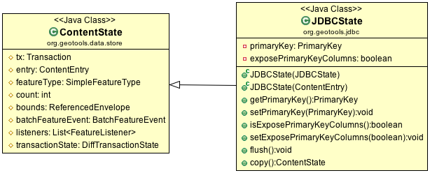

:Author: Jody Garnett
:Thanks: geotools-devel list
:Version: |release|
:License: Creative Commons with attribution

Optimization
------------

In this part we will explore several Optimization techniques for CSVDataStore.

Query Hints
^^^^^^^^^^^

The GeoTools Hints system can be used to configure a DataStore for use by an application. This is often done to speed things up by providing the Factories that the DataStore will use during the course of its operation.

As an example a CurvedGeoemtryFactory with a specific tolerance can be passed in to aid in parsing WKT containing arcs:

.. code-block:: java
   
   Query query = new Query( typeName );
   Hints hints = new Hints();
   hints.put( Hints.JTS_GEOMETRY_FACTORY, new CurvedGeometryFactory( 0.005 ) );
   query.setHints(hints);   
   SimpleFeatureCollection features = featureSource.getFeatures( query );

To interactively discover what hints are supported clients call FeatureSource.getSupportedHints().

At the time of writing the following hints are supported:

* Hints.FEATURE_DETACHED: indicates returned features are a copy (can can be modified without side-effect)
* Hints.JTS_GEOMETRY_FACTORY: control of geometry representation
* Hints.JTS_COORDINATE_SEQUENCE_FACTORY: control of coordinate storage (you may be able to optimise read performance by directly using the binary data provided by your dataformat, or you may wish to optimise for memory use).
* Hints.JTS_PRECISION_MODEL: configure to match precision maintained by coordinate sequence factory
* Hints.JTS_SRID: for compatibility with systems using a spatial reference system identifier (such as PostGIS)
* Hints.GEOMETRY_DISTANCE: used to select a geometry of appropriate generalization. Your datastore may wish to simplify "on the fly" while reading the geometry
* Hints.FEATURE_2D: used to indicate that only two dimensions are required (ignoring the 3rd dimension for 2.5D data)

Many of these values are filled in when rendering, by taking advantage of these query hints you can offer vastly improved performance.  

QueryCapabilities
^^^^^^^^^^^^^^^^^

Your implementation can also advertise additional functionality using the FeatureSource.getQueryCapabilities() data structure.

Formats that allows user supplied FeatureIds when adding new features fill in QueryCapabilities.isUseProvidedFIDSupported() to return true.

To use this approach CSVDataStore would need to be extended with an FID_COLUMN parameter (to be used as a FeatureId). This works when reading (or modifying) existing features, but we run into a glitch in the API when inserting new features ... the feature id cannot be changed!

The workaround is to ask clients to store the proposed FeatureId in the user data map:

.. code-block:: java

   public String[] encode(SimpleFeature feature) {
        List<String> csvRecord = new ArrayList<String>();
        
        String fid = feature.getId();
        if( Boolean.TRUE.equals( feature.getUserData().get(Hints.USE_PROVIDED_FID) ) ){
            if( feature.getUserData().containsKey(Hints.PROVIDED_FID)){
                fid = (String) feature.getUserData().get(Hints.PROVIDED_FID);
            }
        }   
        csvRecord.add(fid);
        
        for (Property property : feature.getProperties()) {
            Object value = property.getValue();
            if (value == null) {
               csvRecord.add("");
            } else {
                String txt = value.toString();
                csvRecord.add(txt);
            }
        }
        return csvRecord.toArray(new String[csvRecord.size()-1]);
    }

Low-Level Optimization
^^^^^^^^^^^^^^^^^^^^^^

Single Use Feature Writers
''''''''''''''''''''''''''

The first level of optimizations available is paying attention to the flags
provided when setting up our CSVFeatureWriter.

The **flags** passed in provide a bit of context for how the FeatureWriter will be
used - so if you have a better implementation on hand you are welcome to use it.

.. code-block:: java

    protected FeatureWriter<SimpleFeatureType, SimpleFeature> getWriterInternal(Query query,
             int flags) throws IOException {
        boolean append = (flags | WRITER_ADD) == WRITER_ADD;
        ...
        return new CSVFeatureWriter(getState(), query, append);
    }

There are three distinct uses for FeatureWriters:

* getFeatureWriter( typeName, transaction )
  
  General purpose FeatureWriter

* getFeatureWriter( typeName, filter, transaction )
  
  An optimized version that does not create new content can be created.

* getFeatureWriterAppend( typeName, transaction)
  
  An optimized version that duplicates the original file, and opens it in append mode can be
  created. We can also perform special tricks such as returning a Feature delegate to the user,
  which records when it has been modified.

.. note:: **Challenge**

    Can you update the CSVFeatureWriter, or create a new one, that can quickly start
    appending content to the end of the file?
    
    Tips:
    
    * It is tempting to start with the use of Files.copy, but remember you need to track the number
      of features in order to generate FeatureIds when appending.
    
    * You may wish to review the implementation of FeatureWriters in ShapeDataStore and JDBCDataStore.

    ..      Files.copy(file.toPath(), temp.toPath(), StandardCopyOption.REPLACE_EXISTING );
            CsvReader count = null;
            try {
                count = ((CSVDataStore)state.getEntry().getDataStore()).read();
                count.getHeaders();
                while(count.readRecord()){
                    nextRow++;
                }
            }
            finally {
                count.close();
            }

Wrapper/Decorator Optimization
''''''''''''''''''''''''''''''

ContentDataStore provides a lot of functionality based on the methods we implemented in the
Tutorials. We also know there are a number of wrappers used to fill in the gaps in our
functionality.

It is worth reviewing **ContentFeatureSource.getReader(Query query)**  to see what wrappers may be
in play.

.. note:: 

   Each wrapper represents a post-processing step that is being applied on your data. If you are making
   use of a service that supports reprojection - then you can implement canReproject() and avoid
   this overhead.
   
.. code-block:: java

        //
        //apply wrappers based on subclass capabilities
        //
        // transactions
        if( !canTransact() && transaction != null && transaction != Transaction.AUTO_COMMIT) {
            DiffTransactionState state = (DiffTransactionState) getTransaction().getState(getEntry());
            reader = new DiffFeatureReader<SimpleFeatureType, SimpleFeature>(reader, state.getDiff());
        }
        
        //filtering
        if ( !canFilter() ) {
            if (query.getFilter() != null && query.getFilter() != Filter.INCLUDE ) {
                reader = new FilteringFeatureReader<SimpleFeatureType, SimpleFeature>( reader, query.getFilter() );
            }    
        }
        
        //retyping
        if ( !canRetype() ) {
            if ( query.getPropertyNames() != Query.ALL_NAMES ) {
                //rebuild the type and wrap the reader
                SimpleFeatureType target = 
                    SimpleFeatureTypeBuilder.retype(getSchema(), query.getPropertyNames());
                
                // do an equals check because we may have needlessly retyped (that is,
                // the subclass might be able to only partially retype)
                if ( !target.equals( reader.getFeatureType() ) ) {
                    reader = new ReTypeFeatureReader( reader, target, false );    
                }
            }
        }
        
        // sorting
        if ( query.getSortBy() != null && query.getSortBy().length != 0 ) {
            if ( !canSort() ) {
                reader = new SortedFeatureReader(DataUtilities.simple(reader), query);
            } 
        }

        
        // offset
        int offset = query.getStartIndex() != null ? query.getStartIndex() : 0;
        if( !canOffset() && offset > 0 ) {
            // skip the first n records
            for(int i = 0; i < offset && reader.hasNext(); i++) {
                reader.next();
            }
        }
        
        // max feature limit
        if ( !canLimit() ) {
            if (query.getMaxFeatures() != -1 && query.getMaxFeatures() < Integer.MAX_VALUE ) {
                reader = new MaxFeatureReader<SimpleFeatureType, SimpleFeature>(reader, query.getMaxFeatures());
            }    
        }
        
        // reprojection
        if ( !canReproject() ) {
            CoordinateReferenceSystem targetCRS = query.getCoordinateSystemReproject();
            if (targetCRS != null) {
                CoordinateReferenceSystem nativeCRS = reader.getFeatureType().getCoordinateReferenceSystem();
                if(nativeCRS == null) {
                    throw new IOException("Cannot reproject data, the source CRS is not available");
                } else if(!nativeCRS.equals(targetCRS)) {
                    try {
                        reader = new ReprojectFeatureReader(reader, targetCRS);
                    } catch (Exception e) {
                        if(e instanceof IOException)
                            throw (IOException) e;
                        else
                            throw (IOException) new IOException("Error occurred trying to reproject data").initCause(e);
                    }
                }
            }    
        }

.. note:: Challenge

  The canRetype() operations is easy to support, check the query and only provide values for the
  requested attributes. This is an especially valuable Optimization to perform at a low-level as
  you may be able to avoid an expensive step (like parsing Geometry) if it is not being requested
  by the client.
  
  Tips:
  
  * Check the Query object passed into your FeatureWriter

A similar set of wrappers is used for FeatureWriter:

.. code-block:: java

    public final FeatureWriter<SimpleFeatureType, SimpleFeature> getWriter( Query query, int flags ) throws IOException {
        query = joinQuery( query );
        query = resolvePropertyNames(query);
        
        FeatureWriter<SimpleFeatureType, SimpleFeature> writer;

        if (!canTransact() && transaction != null && transaction != Transaction.AUTO_COMMIT) {
            DiffTransactionState state = (DiffTransactionState) getTransaction().getState(getEntry());
            FeatureReader<SimpleFeatureType, SimpleFeature> reader = getReader(query);
            writer = new DiffContentFeatureWriter(this, state.getDiff(), reader);
        } else {
            writer = getWriterInternal(query, flags);

            // events
            if (!canEvent()){
                writer = new EventContentFeatureWriter(this, writer );
            }
            // filtering
            if (!canFilter()) {
                if (query.getFilter() != null && query.getFilter() != Filter.INCLUDE) {
                    writer = new FilteringFeatureWriter(writer, query.getFilter());
                }
            }

            // Use InProcessLockingManager to assert write locks?
            if (!canLock()) {
                LockingManager lockingManager = getDataStore().getLockingManager();
                writer = ((InProcessLockingManager) lockingManager).checkedWriter(writer,
                        transaction);
            }
        }
        
        // Finished
        return writer;
    }

The wrapper classes mentioned above are excellent examples on how to create your own FeatureWriters.

.. note::
   
   Historically Filter.ALL and Filter.NONE were used as placeholder,
   as crazy as it sounds, Filter.ALL filters out ALL (accepts none)
   Filter.NONE filters out NONE (accepts ALL).
   
   These two have been renamed in GeoTools 2.3 for the following:
   
   * Filter.ALL has been replaced with Filter.EXCLUDE
   * Filter.NONE has been replaced with Filter.INCLUDE

Every helper class we discussed above can be replaced if your external data source supports the
functionality.

Custom ContentState
'''''''''''''''''''

JDBDataStore supplies an example of subclassing ContentEntry to store additional information.

   
   JDBCState

.. note:: Challenge

   Create your own CSVState and wire it into CSVDataStore.
   
   If you like you can use your CSVState to store a SpatialIndex listing the row numbers.

High-Level Optimization
^^^^^^^^^^^^^^^^^^^^^^^

DataStore, FeatureSource and FeatureStore provide a few methods specifically set up
for Optimization.

DataStore Optimization
''''''''''''''''''''''

DataStore leaves open a number of methods for high-level optimisations:

* ContentDataStore.getCount( query )
* ContentDataStore.getBounds( query )

ContentDataStore has already done a good job of isolating this calculation and recording
the result on ContentState (so it is not regenerated each time).

FeatureStore Optimization
''''''''''''''''''''''''''

DataStores operating against rich external data sources can often perform high level Optimizations.
JDBCDataStores for instance can often construct SQL statements that completely fulfill a request
without making use of FeatureWriters at all.

When performing these queries please remember two things:

1. Check the lockingManager - If you are not providing your own native locking support, please
   check the user's authorisation against the the lockingManager
2. Event Notification - Remember to fire the appropriate notification events when contents change,
   Feature Caches will depend on this notification to accurately track the contents of your
   DataStore

.. note:: **Challenge** 

   Since the FeatureId for CSV files is determined by row number, you can quickly scan to
   to a requested FeatureID by skipping an appropriate number of rows.
   
   Use this knowledge to implement an optimized version of FeatureSource.removeFeatures(Filter filter)
   that detects the use of an Id filter.
   
   Hint: The Id Filter contains a Set<FeatureId> - and you deliberately constructed your FeatureId
   with a consistent pattern.
