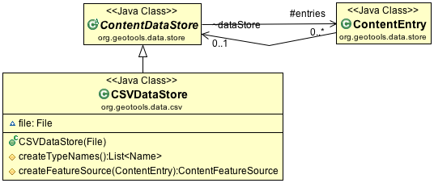
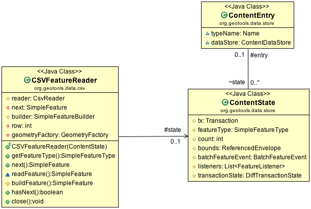

:Author: Jody Garnett
:Thanks: geotools-devel list
:Version: |release|
:License: Creative Commons with attribution

Implementing FeatureSource
--------------------------

Now with the setup out of the way we can get to work.

CSVDataStore
^^^^^^^^^^^^

The first step is to create a basic DataStore that only supports feature extraction. We will read
data from a CSV file into the GeoTools feature model.

   
   CSVDataStore

To implement a DataStore we will subclass ContentDataStore. This is a helpful base class for
making new kinds of content available to GeoTools. The GeoTools library works with an interaction
model very similar to a database - with transactions and locks. ContentDataStore is going to handle
all of this for us - as long as we can teach it how to access our content.

ContentDataStore requires us to implement the following two methods:

* createTypeNames()
* createFeatureSource(ContentEntry entry) 

The class *ContentEntry* is a bit of a scratch pad used to keep track of things for each type.

Our initial implementation will result in a read-only datastore for accessing CSV content:

#. Set up a org.geotools.tutorial.csv package in :file:`src/main/java`.

#. To begin create the file CSVDataStore extending ContentDataStore

   .. literalinclude:: /../src/main/java/org/geotools/tutorial/csv/CSVDataStore.java
      :language: java
      :start-after: // header start
      :end-before: // header end

#. We are going to be working with a single CSV file

   .. literalinclude:: /../src/main/java/org/geotools/tutorial/csv/CSVDataStore.java
      :language: java
      :start-after: // constructor start
      :end-before: // constructor end

#. Add the reader

   .. literalinclude:: /../src/main/java/org/geotools/tutorial/csv/CSVDataStore.java
      :language: java
      :start-after: // reader start
      :end-before: // reader end

#. Listing TypeNames

   A DataStore may provide access to several different data products. The method **createTypeNames** provides a list of the information being published. 

   After all that lead-in you will be disappointed to note that our list will be a single value - the name of the CSV file.

   .. literalinclude:: /../src/main/java/org/geotools/tutorial/csv/CSVDataStore.java
      :language: java
      :start-after: // createTypeNames start
      :end-before: // createTypeNames end

#. Next we have the **createFeatureSource** method.

   This is used to create a **FeatureSource** which is used by client code to access content. There is no cache for **FeatureSource** instances as they are managed directly by client code. Don't worry that is not as terrible as it sounds, we do track all the information and resources made available to a **FeatureSource** in a **ContentEntry** data structure. You can think of the **FeatureSource** instances sent out into the wild as light weight wrappers around **ContentEntry**.

   It is worth talking a little bit about **ContentEntry** which is passed into this method as a parameter. **ContentEntry** is used as a scratchpad holding all recorded information about the content we are working with.

   .. figure:: images/ContentEntry.png
   
      ContentEntry

   **ContentEntry** also contains a back pointer to the **ContentDataStore** in case your implementation of **FeatureSource** needs to phone home.

#. Implement createFeatureSource. Technically the **ContentEntry** is provided as "parameter object" holding the type name requested by the user, and any other context known to the DataStore.

   .. literalinclude:: /../src/main/java/org/geotools/tutorial/csv/CSVDataStore.java
      :language: java
      :start-after: // createFeatureSource start
      :end-before: // createFeatureSource end

CSVFeatureSource
^^^^^^^^^^^^^^^^

Next we can create the **CSVFeatureSource** mentioned above. This class is responsible for providing access to the contents of our CSVDataStore. 

.. note:: The distinction between DataStore and FeatureSource can be difficult to demonstrate as our example consists of a single file. If it helps DataStore is an object representing the file, service or database. FeatureSource meanwhile represents the contents, data product, or table being published.

#. Create the file CSVFeatureSource.

   .. literalinclude:: /../src/main/java/org/geotools/tutorial/csv/CSVFeatureSource.java
      :language: java
      :start-after: // header
      :end-before: // getDataStore start

#. To assist others we can type narrow our **getDataStore()** method to explicitly to return a **CSVDataStore**. In addition to being accurate, this prevents a lot of casts resulting in more readable code.
  
   .. literalinclude:: /../src/main/java/org/geotools/tutorial/csv/CSVFeatureSource.java
      :language: java
      :start-after: // getDataStore start
      :end-before: // getDataStore end

#. The method **getReaderInternal( Query )** used to provide streaming access to out data - reading one feature at a time. The **CSVFeatureReader** returned is similar to an iterator, and is implemented in the next section.

   .. literalinclude:: /../src/main/java/org/geotools/tutorial/csv/CSVFeatureSource.java
      :language: java
      :start-after: // reader start
      :end-before: // reader end
      
   .. note:: The DataStore interface provides a wide range of functionality for client code access feature content.

      Here at the implementation level we provide a single implementation of **getReaderInternal**. This method is used by the superclass **ContentFeatureSource** to access our content. All the additional functionality from filtering to transaction independence is implemented using a combination of wrappers and post-processing.

#. ContentFeatureSource supports two common optimisations out of the box.
   
   You are required to implement the abstract method **getCountInternal( Query )** using any tips or tricks available to return a count of available features. If there is no quick way to generate this information returning ``-1`` indicates that they Query must be handled feature by feature.
   
   For CSV files we can check to see if the Query includes all features - in which case we can skip over the header and quickly count the number of lines in our file. This is much faster than reading and parsing each feature one at a time.
   
   .. literalinclude:: /../src/main/java/org/geotools/tutorial/csv/CSVFeatureSource.java
      :language: java
      :start-after: // count start
      :end-before: // count end
      
#. The second optimisation requires an implementation of **getBoundsInternal(Query)** making use of any spatial index, or header, record the data bounds. This value is used when rendering to determine the clipping area.

   .. literalinclude:: /../src/main/java/org/geotools/tutorial/csv/CSVFeatureSource.java
      :language: java
      :start-after: // bounds start
      :end-before: // bounds end

#. The next bit of work involves declaring what kind of information we have available.
   
   In database terms the schema for a table is defined by the columns and the order they are declared in.
   
   The FeatureType generated here is based on the CSV Header, along with a few educated guesses to recognise LAT and LON columns as comprising a single Location.

   .. literalinclude:: /../src/main/java/org/geotools/tutorial/csv/CSVFeatureSource.java
      :language: java
      :start-after: // schema start
      :end-before: // schema end

CSVFeatureReader
^^^^^^^^^^^^^^^^

FeatureReader is similar to the Java Iterator construct, with the addition of
FeatureType (and IOExceptions).

   
   CSVFeatureReader and Support Classes

The class **ContentState** is available to store any state required. Out of the box **ContentState** provides a cache of FeatureType, count and bounds. You are encouraged to create your own subclass of **ContentState** to track additional state - examples include security credentials or a database connection.

.. note:: Subclassing ContentState is a key improvement made for ContentDataStore. In our earlier base class we noticed many developers creating HashMaps to cache individual results in an effort to improve performance. Inevitability there would be difficulty keeping these caches in sync. Breaking out an object to handle the state required for data access is vast improvement.

FeatureReader interface:

* FeatureReader.getFeatureType()
* FeatureReader.next()
* FeatureReader.hasNext()
* FeatureReader.close()

To implement our FeatureReader, we will need to do several things: open a File and read through it
line by line, parsing Features as we go. Because this class actually does some work, we are going to include a few more comments in the code to keep our heads on straight.

1. Create the class **CSVFeatureReader** as follows:
   
   .. literalinclude:: /../src/main/java/org/geotools/tutorial/csv/CSVFeatureReader.java
      :language: java
      :end-before: // class definition end
      :append: }

2. Implement the iterator next() and hasNext() methods using a field to hold the value to return next.
   
   .. literalinclude:: /../src/main/java/org/geotools/tutorial/csv/CSVFeatureReader.java
      :language: java
      :start-after: // read start
      :end-before: // read end

   .. note:: The next() and hasNext() methods are allowed to throw IOExceptions making these methods easy to implement. Most client code will use this implementation behind a **FeatureIterator** wrapper that converts any problems to a RuntimeException. A classic easy of implementation vs easy of use tradeoff.

3. Using the **CSVReader** library to parse the content saves a lot of work - and lets us focus on building features. The utility class **FeatureBuilder** gathers up state, employing a **FeatureFactory** on your behalf to construct each feature.
   
   .. literalinclude:: /../src/main/java/org/geotools/tutorial/csv/CSVFeatureReader.java
      :language: java
      :start-after: // parse start
      :end-before: // parse end
   
   .. note:: A key API contact is the construction of a unique **FeatureID** for each feature in the system. Our convention has been to prefix the typename ahead of any native identifier (in this case row number). Each **FeatureID** being unique is a consequence of following the OGC Feature Model used for Web Feature Server. These identifiers created here are employed in the generation of XML documents and need to follow the restrictions on XML identifiers.

4. Finally we can **close()** the CSVFeatureReader when no longer used. Returning any system resources (in this case an open file handle).

   .. literalinclude:: /../src/main/java/org/geotools/tutorial/csv/CSVFeatureReader.java
      :language: java
      :start-after: // close start
      :end-before: // close end
   
   .. note:: The FeatureState is not closed or disposed - as several threads may be making concurrent use of the **CSVDataStore**.

   
CSVDataStoreFactory
^^^^^^^^^^^^^^^^^^^

Now that we have implemented accessing and reading content what could possibly be left?

This is GeoTools so we need to wire in our new creation to the Factory Service Provider (SPI) plug-in system so that application can smoothly integrate our new creation.

To make your DataStore truly independent and pluggable, you must create a class implementing the
**DataStoreFactorySPI** interface.

This allows the Service Provider Interface mechanism to dynamically plug in your new DataStore with
no implementation knowledge. Code that uses the DataStoreFinder can just add the new DataStore to
the classpath and it will work!

The DataStoreFactorySpi provides information on the Parameters required for construction.
DataStoreFactoryFinder provides the ability to create DataStores representing existing
information and the ability to create new physical storage.

1. Implementing DataStoreFactorySPI:
   
   * The "no argument" constructor is required as it will be used by the
     Factory Service Provider (SPI) plug-in system.
   * getImplementationHints() is used to report on any "Hints" used for configuration
     by our factory. As an example our Factory could allow people to specify a specific
     FeatureFactory to use when creating a feature for each line.
     
   Create CSVDataStoreFactory as follows:

   .. literalinclude:: /../src/main/java/org/geotools/tutorial/csv/CSVDataStoreFactory.java
      :language: java
      :end-before: // definition end

2. We have a couple of methods to describe the DataStore.

   This *isAvailable* method is interesting in that it can become a performance bottleneck if not implemented efficiently. DataStoreFactorySPI factories are *all* called when a user attempts to connect, only the factories marked as *available* are shortlisted for further interaction.

   .. literalinclude:: /../src/main/java/org/geotools/tutorial/csv/CSVDataStoreFactory.java
      :language: java
      :start-after: // metadata start
      :end-before: // metadata end

3. The user is expected to supply a Map of connection parameters when creating a datastore.
   
   The allowable connection parameters are described using *Param[]*. Each *Param* describes a *key* used to store the value in the map, and the expected Java type for the value. Additional fields indicate if the value is required and if a default value is available.
   
   This array of parameters form an API contract used to drive the creation of user interfaces.
   
   The API contract is open ended (we cannot hope to guess all the options needed in the future). The helper class **KVP** provides an easy to use implementation of **Map<String,Object>**. The keys used here are formally defined as static constants - complete with javadoc describing their use. If several authors agree on a new hint it will be added to these static constants.
   
   .. literalinclude:: /../src/main/java/org/geotools/tutorial/csv/CSVDataStoreFactory.java
      :language: java
      :start-after: // getParametersInfo start
      :end-before: // getParametersInfo end
      
   .. note:: Does anything really use this?
      
      The **gt-swing** module is able to construct a user interface based on these **Param**
      descriptions. The uDig and GeoServer projects have similar auto-generated screens.
      
      .. figure:: /tutorial/filter/images/shapeWizard1.png
         
         Shapefile User Parameters
      
      .. figure:: /tutorial/filter/images/shapeWizard2.png
        
        Shapefile Advanced Parameters

      
4. Next we have some code to check if a set of provided connection parameters can actually be used.
   
   .. literalinclude:: /../src/main/java/org/geotools/tutorial/csv/CSVDataStoreFactory.java
      :language: java
      :start-after: // canProcess start
      :end-before: // canProcess end
      
5. Armed with a map of connection parameters we can now create a Datastore for an **existing** csv file.

   Here is the code that finally calls our CSVDataStore constructor:
   
   .. literalinclude:: /../src/main/java/org/geotools/tutorial/csv/CSVDataStoreFactory.java
      :language: java
      :start-after: // createDataStore start
      :end-before: // createDataStore end

6. How about creating a DataStore for a **new** csv file?
     
   Since initially our DataStore is read-only we will just throw an UnsupportedOperationException at this time.

   .. literalinclude:: /../src/main/java/org/geotools/tutorial/csv/CSVDataStoreFactory.java
      :language: java
      :start-after: // createNewDataStore start
      :end-before: // createNewDataStore end
   
6. The Factory Service Provider (SPI) system operates by looking at the META-INF/services
   folder and checking for implementations of DataStoreFactorySpi

   To "register" our CSVDataStoreFactory please create the following in `src/main/resources/`:

   *  META-INF/services/org.geotools.data.DataStoreFactorySpi

   This file requires the filename of the factory that implements the DataStoreSpi interface.

   Fill in the following content for your **org.geotools.data.DataStoreFactorySpi** file::
    
       org.geotools.tutorial.csv.CSVDataStoreFactory
   
That is it, in the next section we will try out your new DataStore.
