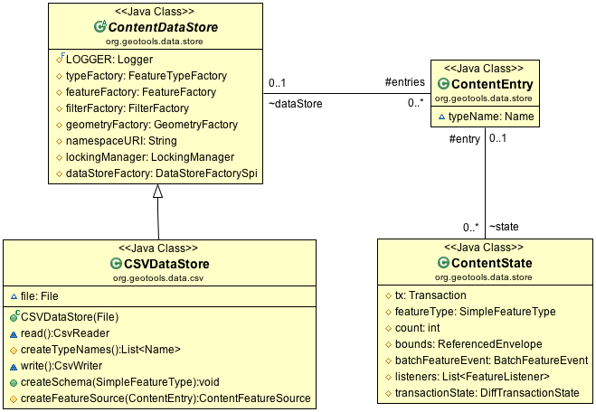
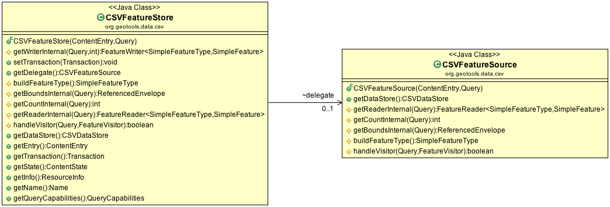
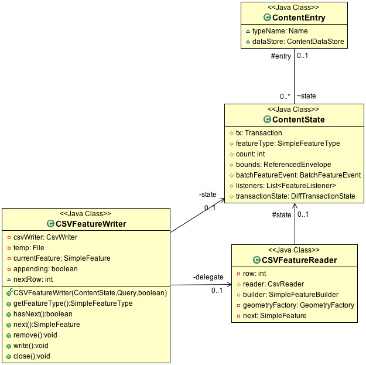

:Author: Jody Garnett
:Thanks: geotools-devel list
:Version: |release|
:License: Creative Commons with attribution

Implementing FeatureStore
-------------------------

In this part we will complete the CSVDataStore. At the end of this section we
will have a full functional CSVDataStore supporting both read and write operations.

   
   CSVDataStore Read-Write
   
The DataStore API provides three categories of public methods involved in making content writeable.

* DataStore.createSchema( featureType ) - sets up a new entry for content of the provided type
* DataStore.getFeatureWriter( typeName ) - a low-level iterator that allows writing
* DataStore.getFeatureSource( typeName ) - read-only FeatureSource or FeatureStore for read-write

The infrastructure to support this functionality is quite extensive. A few highlights from the above diagram:

* ContentState.listeners - event notification for changed content
* ContentState.tx  - transaction object used by clients to stash session callbacks
* ContentState.transactionState: provides transaction independence between threads working on the same content.

CSVDataStoreFactory
^^^^^^^^^^^^^^^^^^^

Now that we are going to be writing files we can fill in the createNewDataStore method.

1. Open up CSVDataStoreFactory and fill in the method **createNewDataStore( Map params )** which we skipped over earlier.

   .. literalinclude:: /../src/main/java/org/geotools/tutorial/csv2/CSVDataStoreFactory.java
      :language: java
      :start-after: // createNewDataStore start
      :end-before: // createNewDataStore end
      :prepend:       private static final Logger LOGGER = Logging.getLogger("org.geotools.data.csv");

2. The above code snippet introduces a GeoTools Logger we can use for warnings.
   
   Because GeoTools is a well mannered library it can be configured to use different logging
   engines. This allows it to integrate smoothly with larger projects.

#. To see this change in context review :download:`CSVDataStoreFactory.java </../src/main/java/org/geotools/tutorial/csv2/CSVDataStoreFactory.java>`
   from the **gt-csv** plugin.
   
There is no DataStoreFinder method for creating new content. We expect this method to be called
from a content creation wizard that already is making use of the DataStoreFactory.

CSVDataStore
^^^^^^^^^^^^

Returning to CSVDataStore we have a number of new methods to override to support write
functionality.

1. Introduce the createSchema( featureType ) method used to set up a new file.
   
   Our CSV format has several limitations:
   
   * Representing Points, using LAT and LON columns
   * Attributes are assumed to be Strings (this is a text format after all)
   * CoordinateReferenceSystem is limited to WGS84
   
   Add createSchema( featureType ):
   
   .. literalinclude:: /../src/main/java/org/geotools/tutorial/csv2/CSVDataStore.java
      :language: java
      :start-after: // createSchema start
      :end-before: // createSchema end
   
2. And revise our implementation of **createFeatureSource( ContentEntry )**.
   
   While we will still return a **FeatureSource**, we have the option of returning the subclass
   **FeatureStore** for read-write files. 
   
   The **FeatureStore** interface provides additional methods allowing the modification of content.

   .. literalinclude:: /../src/main/java/org/geotools/tutorial/csv2/CSVDataStore.java
      :language: java
      :start-after: // createFeatureSource start
      :end-before: // createFeatureSource end

#. If you would like to review the **gt-csv** plugin has the completed :download:`CSVDataStore.java </../src/main/java/org/geotools/tutorial/csv2/CSVDataStore.java>`
   file.
   
CSVFeatureStore
^^^^^^^^^^^^^^^

CSVFFeatureStore has an interesting design constraint:

* It implements FeatureStore, which extends FeatureSource
* It extends the base class ContentFeatureStore, which handles most of the heavy lifting

So what is the trouble? Java only allows single inheritance - forcing us to account for all the
work we did reading features in CSVFeatureSource.

Many first generation DataStore implementations practised cut and paste coding, meaning fixes would
often get applied in one spot and not another making for a frustrating debugging experience.

Instead we are going to use a **delegate** CSVFeatureSource, hidden from public
view, simply to call its methods for reading. This prevents code duplication,
making the code easier to maintain, at the cost of some up front complexity.

   
   CSVFeatureStore
   
We have to play a few tickets to ensure both the CSVFeatureStore and its hidden CSVFeatureSource
are always on the same transaction, but other than that this approach is working well.

  #. Create **CSVFeatureStore**:

     .. literalinclude:: /../src/main/java/org/geotools/tutorial/csv2/CSVFeatureStore.java
        :language: java
        :start-after: package org.geotools.tutorial.csv2;
        :end-before: // header end
        :prepend: package org.geotools.tutorial.csv;  

  #. Our first responsibility is to implement a CSVFeatureWriter for internal use. Transaction and Event
     Notification are handled by wrappers applied to our CSVFeatureWriter.
      
     .. literalinclude:: /../src/main/java/org/geotools/tutorial/csv2/CSVFeatureStore.java
        :language: java
        :start-after: // getWriter start
        :end-before: // getWriter end
     
     .. note:: 
        
        
        In general the "Gang of Four" decorator pattern is used to layer functionality around the
        raw **FeatureReader** and **FeatureWriters** you provided. This is very similar to the design
        of the **java-io** library (where a BufferedInputStream can be wrapped around a raw
        FileInputStream).
        
        You can control which decorators/wrappers are applied, by as shown in the following table.
        
            ==================== ===============
            Handle               Override
            ==================== ===============
            reprojection         canReproject()
            filtering            canFilter()
            max feature limiting canLimit()
            sorting              canSort()
            locking              canLock()
            ==================== ===============
        
        As an example if your data format supported an attribute index you would be
        in position to override canSort() to return true if an index was available
        for sorting.

  #. Next we can set up our delegate, taking care to ensure both use the same Transaction.
     
     .. literalinclude:: /../src/main/java/org/geotools/tutorial/csv2/CSVFeatureStore.java
        :language: java
        :start-after: // transaction start
        :end-before: // transaction end
        
  #. Use the delegate to implement the internal ContentDataStore methods. In Eclipse you can use Source->Generate Delegate Methods to speed this up.

     .. literalinclude:: /../src/main/java/org/geotools/tutorial/csv2/CSVFeatureStore.java
        :language: java
        :start-after: // internal start
        :end-before: // internal end
        
  #. We have to do one "fix" to allow handle visitor method to be called - add the following to **CSVFeatureSource**.
        
     .. literalinclude:: /../src/main/java/org/geotools/tutorial/csv2/CSVFeatureSource.java
        :language: java
        :start-after: // visitor start
        :end-before: // visitor end
     
     .. warning:: Double check you are adding the above to CSVFeature **Source**.
     
     .. note::
     
        Why does this work - because Java visibility rules are insane.
        Even though the method is marked *protected* it now has *package*
        visibility can be called by its peer CSVFeatureStore. 
      
  #. Use the delegate to implement the public FeatureSource methods.
   
     .. literalinclude:: /../src/main/java/org/geotools/tutorial/csv2/CSVFeatureStore.java
        :language: java
        :start-after: // public start
        :end-before: // public end

  #. You can see what this looks like in context by reviewing the :download:`CSVFeatureStore.java </../src/main/java/org/geotools/tutorial/csv2/CSVFeatureStore.java>` from the **gt-csv** plugin.

CSVFeatureWriter
^^^^^^^^^^^^^^^^

This class uses an interesting trick to simulate updating a file in place, while still supporting
streaming operation. We will be outputting content to a temporary file, leaving the original for
concurrent processes such as rendering. When streaming is closed the temporary file is moved into the correct location to effect the change.

   
   CSVFeatureWriter

To avoid duplicating all the work we put into **CSVFeatureReader** this code uses the same delegate
trick encountered earlier.

A couple common questions:

* Q: How do you make a Transaction out of our simple reader?
  
  ContentFeatureSource uses wrappers (or delegates) to process the data on the fly as it is read off disk. Wrappers can do all kinds of work, from cutting off reading when "max feature limit" is hit, or in the case of transactions modifying the content as it is read to match any edits that have been made.

* Q: How do you know what wrappers to use?
  
  ContentFeatureSource checks to see if a wrapper is needed.
  
  For example a query with a "max feature limit" is implemented using the MaxFeatureReader wrapper.
  
  .. code-block:: java
  
      // max feature limit
      if ( !canLimit() ) {
        if (query.getMaxFeatures() != -1 && query.getMaxFeatures() < Integer.MAX_VALUE ) {
            reader = new MaxFeatureReader<SimpleFeatureType, SimpleFeature>(reader, query.getMaxFeatures());
        }    
      }
  
  MaxFeatureWrapper counts the features that are returned, and returns hasNext() false
  once the configured limit has been reached:
  
  .. code-block:: java

      public boolean hasNext() throws IOException {
        return (featureReader.hasNext() && (counter < maxFeatures));
      }
  
* Q: How does that work with transactions?
  
  ContentState manages a DiffTransactionState used to capture each modification. Each change is
  recorded by FeatureId (a feature recorded for each add or modification, or null 
  for a delete).
  
  .. figure:: images/Transaction.png
     
     Transaction and DiffTransactionState
     
  As CSVFeatureReader is used to access the file contents, a wrapper checks the Diff
  and dynamically modifies the content to match any outstanding edits. When it reaches the end of
  your file, it keeps going listing any features that were added.

* Q: That is fine for transaction independence, what if two FeatureSources are using the
  same Transaction?
  
  Those two FeatureSources would be configured with the same ContentState, and thus have the same
  view of the world.
  
  The ContentDataStore API is divided into two levels:
  
  * Public classes focused on ease of use for client code - examples include DataStore,
    FeatureSource, Transaction.
    
    .. image:: images/public.png
    
  * Private classes focused on ease of development for DataStore developers - examples include
    ContentEntry, ContentEntry, BatchFeatureEvent
    
    .. image:: images/Internal.png
  
  .. note::
     
     Our first generation DataStore implementations tried to produce a similar effect using a
     series of HashMaps, with suitably scary consequences for code readability. If any additional
     information is required by your DataStore implementation you are actively encouraged to
     subclass ContentState.
  
* Q: Wait what about when I am not using a Transaction? How do I get a ContentState?
  
  When the use has not specified a Transaction we default to the use of Transaction.AUTO_COMMIT.
  
  This makes the ContentState recorded for Transaction.AUTO_COMMIT special in that it represents
  the point of truth on the files current status. The bounds recorded for Transaction.AUTO_COMMIT
  are the bounds of the file. The number of features recorded for Transaction.AUTO_COMMIT are the
  number of features recorded in the file.

Now that we have some idea of what is riding on top, lets implement our CSVFeatureWriter:

#. Create the file CSVFeatureWriter.java:

   .. literalinclude:: /../src/main/java/org/geotools/tutorial/csv2/CSVFeatureWriter.java
      :language: java
      :start-after: package org.geotools.tutorial.csv2;
      :end-before: // header end
      :prepend: package org.geotools.tutorial.csv;  
      :append: }

#. Our construct is responsible for a lot of activities:
   
   * Setting up a temporary file for output
   * Creating a CsvWriter for output
   * Quickly making a copy of the file if we are just interested in appending
   * Starting the file off with a copy of the headers
   * Creating a delegate to read the original file
   * Check if the columns are lat,lon or lon,lat for when we write them out.
   
   Putting all that together:
   
   .. literalinclude:: /../src/main/java/org/geotools/tutorial/csv2/CSVFeatureWriter.java
      :language: java
      :start-after: // constructor start
      :end-before: // constructor end

#. Add FeatureWriter.getFeatureType() implementation:

   .. literalinclude:: /../src/main/java/org/geotools/tutorial/csv2/CSVFeatureWriter.java
      :language: java
      :start-after: // featureType start
      :end-before: // featureType end

#. Add hasNext() implementation, making use of delegate before switching over to 
   returning false when appending.

   .. literalinclude:: /../src/main/java/org/geotools/tutorial/csv2/CSVFeatureWriter.java
      :language: java
      :start-after: // hasNext start
      :end-before: // hasNext end

#. The *next()* method is used for two purposes:
   
   * To access Features for modification or removal (when working through existing content)
   * To create new Features (when working past the end of the file)
   
   The *next()* implementation has a couple of interesting tricks:
   
   * Care is taken to write out the currentFeature if required
   * The next feature is fetched from the delegate; or
   * when appending a new feature is created for the user to fill in with attributes
   
   Here is what that looks like:

   .. literalinclude:: /../src/main/java/org/geotools/tutorial/csv2/CSVFeatureWriter.java
      :language: java
      :start-after: // next start
      :end-before: // next end
   
   .. note::
   
      There are a large number of utility classes to perform common functions, take a look around
      before building something yourself.
      
      * DataUtilities: Mix of methods helping developers use DataStore, with a few methods to help
        implementors perform common tasks. Acts as Facade for a wide range of services
      * SimpleFeatureBuilder: used to ease interaction with FeatureFactory

7. Add remove() implementation, marking the currentFeature as null.

   .. literalinclude:: /../src/main/java/org/geotools/tutorial/csv2/CSVFeatureWriter.java
      :language: java
      :start-after: // remove start
      :end-before: // remove end

6. Add write() implementation, note how we have to keep track of the axis order (surprisingly this is not fixed):
   
   .. literalinclude:: /../src/main/java/org/geotools/tutorial/csv2/CSVFeatureWriter.java
      :language: java
      :start-after: // write start
      :end-before: // write end
      
   .. note::
      
      Previous implementations would make a copy of the feature to return. When write was called
      copy would be compared to the original to see if any change had been made. Why? So that an
      appropriate event notification could be sent out.
      
      This is another case where a wrapper has been created, and applied by ContentFeatureStore.

8. Like the constructor the implementation of *close()* has a number of responsibilities.
    
   To implement close() we must remember to write out any remaining features in the delegate
   before closing our new file.
   
   The last thing our FeatureWriter must do is replace the existing File with our new one.

   .. literalinclude:: /../src/main/java/org/geotools/tutorial/csv2/CSVFeatureWriter.java
      :language: java
      :start-after: // close start
      :end-before: // close end

#. You can see what this looks like in context by reviewing the :download:`CSVFeatureWriter.java </../src/main/java/org/geotools/tutorial/csv2/CSVFeatureWriter.java>` from the **gt-csv** plugin.
   
