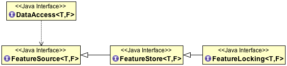

:Author: Jody Garnett
:Thanks: geotools-devel list
:Version: |release|
:License: Creative Commons with attribution

Using FeatureStore
------------------

Now that we have completed our CSVDataStore implementation, we can explore the remaining
capabilities of the DataStore API.

DataStore actually extends DataAccess which was introduced to allow GeoTools to work with more
general feature content including properties, attributes and associations.

   
   DataAccess

DataStore, along with a few subclasses, are limited to work with SimpleFeature (values only, order
significant).

.. figure:: images/DataStore.png
   
   DataStore

CSVDataStore API for data modification:

* CSVDataStore.createSchema( featureType )
* CSVDataStore.getFeatureWriter( typeName, filter, Transaction )
* CSVDataStore.getFeatureWriter( typeName, Transaction )
* CSVDataStore.getFeatureWriterAppend( typeName, Transaction )
* CSVDataStore.getFeatureSource( typeName )

FeatureSource
^^^^^^^^^^^^^

The DataStore.getFeatureSource( typeName ) method is the gateway to our high level api, as
provided by an instance of FeatureSource, FeatureStore or FeatureLocking.

Now that we have implemented writing operations, the result of this method supports:

* FeatureSource: the query operations outlined in the :doc:`../filter/query` 
* FeatureStore: modification and transaction support
* FeatureLocking: Interaction with a Feature-based Locking

FeatureStore
''''''''''''

FeatureStore provides Transaction support and modification operations. FeatureStore is an
extension of FeatureSource.

You may check the result of getFeatureSource( typeName ) with the :code:`instanceof` operator.

Example of FeatureStore use:

.. literalinclude:: /../src/main/java/org/geotools/tutorial/csv2/CSVWriteTest.java
   :language: java
   :start-after: // featureStoreExample start
   :end-before: // featureStoreExample end

FeatureStore defines:
    
* FeatureStore.addFeatures( featureReader)
* FeatureStore.removeFeatures( filter )
* FeatureStore.modifyFeatures( type, value, filter )
* FeatureStore.modifyFeatures( types, values, filter )
* FeatureStore.setFeatures( featureReader )
* FeatureStore.setTransaction( transaction )

Once again, many DataStores are able to provide optimized implementations of these operations.

Transaction Example:

.. literalinclude:: /../src/main/java/org/geotools/tutorial/csv2/CSVWriteTest.java
   :language: java
   :start-after: // transactionExample start
   :end-before: // transactionExample end

This produces the following output:

  .. literalinclude:: artifacts/write-output.txt
     :language: text
     :start-after: transactionExample start
     :end-before: transactionExample end

Resulting in the following file:

  .. literalinclude:: artifacts/write-output.txt
     :language: text
     :start-after: transactionExample contents start
     :end-before: transactionExample contents end

.. note::
   
   Please review the above code example carefully as it is the best explanation
   of transaction independence you will find.
   
   Specifically:
   
   * "auto-commit" represents the current contents of the file on disk
   
   * Notice how the transactions only reflect the changes the user made relative to
     the current file contents.
     
     This is shown after t1 commit, where transaction t2 is seeing 4 features (ie the
     current file contents plus the one feature that has been added on t2).
     
   * This really shows that FeatureSource and FeatureStore are "views" into your data.
     
     If you configure two FeatureStores with the same transaction they will act the same.
     
     Transaction is important and represents what you are working on FeatureStore is not as
     important and is just used to make working with your data easier (or more efficient)
     than direct use of FeatureWriter.
  
FeatureLocking
''''''''''''''

FeatureLocking is the last extension to our high-level API. It provides support for preventing
modifications to features for the duration of a Transaction, or a period of time.

FeatureLocking defines:

* FeatureLocking.setFeatureLock( featureLock )
* FeatureLocking.lockFeatures( query ) - lock features specified by query
* FeatureLocking.lockFeatures( filter ) - lock according to constraints
* FeatureLocking.lockFeatures() - lock all
* FeatureLocking.unLockFeatures( query )
* FeatureLocking.unLockFeatures( filter )
* FeatureLocking.unLockFeatures()
* FeatureLocking.releaseLock( string )
* FeatureLocking.refreshLock( string )

The concept of a FeatureLock matches the description provided in the OGC Web Feature Server
Specification. Locked Features can only be used via Transactions that have been provided with
the correct authorization.

FeatureWriter
^^^^^^^^^^^^^

The **DataStore.getFeatureWriter( typeName, filter, transaction )** method 
creates a FeatureWriter used to modify features indicated by a constraint.

Example - removing all features:

.. literalinclude:: /../src/main/java/org/geotools/tutorial/csv2/CSVWriteTest.java
   :language: java
   :start-after: // removeAllExample start
   :end-before: // removeAllExample end

This produces the following output:

  .. literalinclude:: artifacts/write-output.txt
     :language: text
     :start-after: removeAllExample start
     :end-before: removeAllExample end

And the following file:

  .. literalinclude:: artifacts/write-output.txt
     :language: text
     :start-after: removeAllExample contents start
     :end-before: removeAllExample contents end

This FeatureWriter does not allow the addition of new content. It can be used for modification
and removal only. DataStores can often provide an optimized implementation.

The **DataStore.getFeatureWriter( typeName, transaction )** method creates a general purpose
FeatureWriter. New content may be added after iterating through the
provided content.

Example - completely replace all features:

.. literalinclude:: /../src/main/java/org/geotools/tutorial/csv2/CSVWriteTest.java
   :language: java
   :start-after: // replaceAll start
   :end-before: // replaceAll end

The modified file:

  .. literalinclude:: artifacts/write-output.txt
     :language: text
     :start-after: replaceAll contents start
     :end-before: replaceAll contents end
     
The **DataStore.getFeatureWriterAppend( typeName, transaction )** method creates a FeatureWriter
for adding content.

Example - making a copy:

.. literalinclude:: /../src/main/java/org/geotools/tutorial/csv2/CSVWriteTest.java
   :language: java
   :start-after: // appendContent start
   :end-before: // appendContent end

The modified file:

  .. literalinclude:: artifacts/write-output.txt
     :language: text
     :start-after: appendContent contents start
     :end-before: appendContent contents end
     
DataStores can often provide an optimized implementation of this method.
