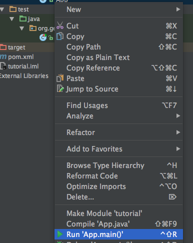

:Author: Devon Tucker
:Thanks: geotools-user list
:Version: |release|
:License: Create Commons with attribution

.. _JetBrains: https://www.jetbrains.com/idea/

IntelliJ Quickstart
===================
This guide will help you setup the IntelliJ IDE in order to work with GeoTools and follow along with the rest of the
GeoTools tutorial.

Pre-Requisites
--------------
This guide assumes the following:

* You have the latest JDK installed (8 at the time this article was written) installed. If not the TODO Eclipse Quickstart
  provides instructions on how to do this.
* You have IntelliJ installed. This article targets IntelliJ CE 2016; however, previous versions at least as far back as
  13 should work fine. Ultimate versions should also work fine. IntelliJ can be downloaded from JetBrains_ and generally
  works out of the box on common operating systems.
  
Create a New Project
--------------------
To start with we'll create a new project using the Maven quickstart archetype.

#. Choose File -> New Project from the menu. In the New Project dialog choose Maven project, ensure *Create from archetype* is selected,
   and choose the *org.apache.maven.archetypes:maven-archetype-quickstart* archetype. Press *Next*
   
   .. image:: images/intellij/new_project_screen.png
      :scale: 65 %
      :align: center
      
#. The next screen asks us for basic identifying information for our project:
   
   * GroupId: org.geotools
   * ArtifactId: tutorial
   * Version: 1.0-SNAPSHOT
   
   .. image:: images/intellij/new_project2.png
      :scale: 65 %
      :align: center
      
#. Hit next. The following screen we should be able to leave with the defaults. For our purposes IntelliJ's bundled Maven should be
   fine, unless the version is lower than 3, in which case you should consider using a new external verision. 
   
   .. image:: images/intellij/new_project3.png
      :scale: 65 %
      :align: center
   
#. Hit next. Give the project a name (this name is only used internally by IntelliJ), tutorial should work for our
   purposes. You can change the project location to suit your needs and hopefully leave *More Settings* as their defaults (recommended)
   
   .. image:: images/intellij/new_project4.png
      :scale: 65 %
      :align: center
   
#. Hit finish and our new project will be created. IntelliJ will show us our newly created Maven file and do an initial Maven build 
   (let this finish before attempting the next steps, it shouldn't take long). IntelliJ should also ask if you want to enable *Auto Import*
   for Maven dependencies. Let's turn that on for the purposes of this tutorial, it will automatically detect changes we make to 
   our POM file and automatically import them.
   
   .. image:: images/intellij/auto_import.png
      :align: center
   
IntelliJ has created an empty App.java with a simple *Hello World!* along with a **JUnit** test case. You can run *App* or *AppTest*
by right clicking on them in the Project Explorer and choosing *Run* from the context menu.

Adding Jars to Your Project
---------------------------

.. sidebar:: Lab
   
   If you're following along with this tutorial a pre-loaded Maven repository may have been provided. We can use *Offline Mode*
   to ensure Maven doesn't try to download any dependencies.
   
   To turn on Offline Mode:
   
   #. Open the *Settings*. On OS X this is IntelliJ -> Preferences, on other OSes it's under File -> Settings
   #. Choose Build, Execution, Deployment -> Build Tools -> Maven
   #. Check the *Work Offline* option
   
The pom.xml file describes the structure, configuration, dependencies and many other facets of your project. We are going to focus
on the dependencies needed for your project.

When downloading jars Maven makes use of a "local repository" to store copies if the dependencies it downloads.

  ==================  ========================================================
     PLATFORM           LOCAL REPOSITORY
  ==================  ========================================================
     Windows XP:      :file:`C:\\Documents and Settings\\You\\.m2\\repository`
     Windows:         :file:`C:\\Users\\You\\.m2\repository`
     Linux and Mac:   :file:`~/.m2/repository`
  ==================  ========================================================
  
Maven downloads jars from public repositories on the internet where projects such as GeoTools publish their work.

#. Open up the `pom.xml` file at the root of the project. You can see some of the information we entered through the wizard
   earlier.
   
#. We're going to add three things to this file. First, at the top of the file after moduleVersion we want to add a 
   properties element defining the version of GeoTools we wish to use. This workbook was written for |release| 
   although you may wish to try a different version.
   
   For production a stable release of |branch| should be used for `geotools.version`:
    
   .. literalinclude:: artifacts/pom.xml
        :language: xml
        :start-after: <url>http://maven.apache.org</url>
        :end-before: <dependencies>
   
   To make use of a nightly build set the `geotools.version` property to |branch|-SNAPSHOT .
    
   .. literalinclude:: artifacts/pom2.xml
        :language: xml
        :start-after: <url>http://maven.apache.org</url>
        :end-before: <dependencies>
        
#. We are going to add a dependence to GeoTools :file:`gt-main` and :file:`gt-swing` jars. Note we
   are making use of the geotools.version defined above.
   
   .. literalinclude:: artifacts/pom.xml
        :language: xml
        :start-after: </properties>
        :end-before: <repositories>
    
#. Finally we need to list the external *repositories* where maven can download GeoTools and and
   other required jars from.

   .. literalinclude:: artifacts/pom.xml
        :language: xml
        :start-after: </dependencies>
        :end-before: <build>

   .. note:: Note the snapshot repository above is only required if you are using a nightly build (such as |branch|-SNAPSHOT)

#. If you'd like to use Java 8 language level features (eg. lambdas), you need to tell Maven to use the 1.8 source level

   .. literalinclude:: artifacts/pom2.xml
      :language: xml
      :start-after: </repositories>
      :end-before: </project>

8. For comparison here is the completed :download:`pom.xml <artifacts/pom.xml>` file for download.

   You may find cutting and pasting to be easier than typing, you can choose Code -> Reformat Code to
   fix indentation
   
Tips:

* If Maven isn't downloading dependencies automatically for some reason (maybe *Auto-Import* is turned off)
  you can manually download dependencies by right-clicking on your project and choosing Maven -> Reimport.
* If you'd like to download the Javadoc for your dependencies you can again go to the Maven context menu and choose
  *Download Documentation*
  
Quickstart Application
----------------------
Now that our environment is set up we can put together a simple Quickstart. This example will display a
shapefile on the screen.

#. Let's create a class called `Quickstart` in the package `org.geotools.tutorial.quickstart`. IntelliJ can 
   create both the package and the class for us in one shot; right click on the org.geootools package in the Project panel
   and in the context menu choose New -> Java Class.
   
   .. image:: images/intellij/new_class_menu.png
      :align: center
      
   .. image:: images/intellij/new_class_dialog.png
      :align: center
      
#. Fill in the following code:

.. literalinclude:: /../src/main/java/org/geotools/tutorial/quickstart/Quickstart.java
      :language: java
      
#. We need to download some sample data to work with. The http://www.naturalearthdata.com/ project
   is a great project supported by the North American Cartographic Information Society.  Head to the link below and download some cultural vectors. You can use the 'Download all 50m cultural themes' at top.

   * `1:50m Cultural Vectors <http://www.naturalearthdata.com/downloads/50m-cultural-vectors/>`_

   Please unzip the above data into a location you can find easily such as the desktop.

#. Run the application to open a file chooser. Choose a shapefile from the example dataset.

   .. image:: images/QuickstartOpen.png
      :scale: 60
 
#. The application will connect to your shapefile, produce a map content, and display the shapefile.

   .. image:: images/QuickstartMap.png
      :scale: 60
 
#. A couple of things to note about the code example:
 
   * The shapefile is not loaded into memory - instead it is read from disk each and every time it is needed
     This approach allows you to work with data sets larger than available memory.
    
   * We are using a very basic display style here that just shows feature outlines. In the examples that follow we will see how to specify more sophisticated styles.
  
Things to Try
=============

Each tutorial consists of very detailed steps followed by a series of extra questions. If you get
stuck at any point please ask your instructor; or sign up to the geotools-users_ email list.

.. _geotools-users: http://docs.geotools.org/latest/developer/communication.html

Here are some additional challenges for you to try:

* Try out the different sample data sets

* You can zoom in, zoom out and show the full extents and Use the select tool to examine individual
  countries in the sample countries.shp file

* Download the largest shapefile you can find and see how quickly it can be rendered. You should
  find that the very first time it will take a while as a spatial index is generated. After that
  performance should be very good when zoomed in.

* Performance: We know that one of the ways people select a spatial library is based on speed.
  By design GeoTools does not load the above shapefile into memory (instead it streams it off
  of disk each time it is drawn using a spatial index to only bring the content required for
  display).

If you would like to ask GeoTools to cache the shapefile in memory try the following code:

    .. literalinclude:: /../src/main/java/org/geotools/tutorial/quickstart/QuickstartCache.java
       :language: java
       :start-after: // docs start cache
       :end-before:  // docs end cache

This code won't compile initially because we're missing an import. IntelliJ should prompt to import
the missing class immediately. Press Alt-Enter (^-Enter on OS X) to bring up a dialog to import the missing class.
It will pull in the following import:

    .. code-block:: java

       import org.geotools.data.CachingFeatureSource;

    .. Note::

       When building you may see a message that CachingFeatureSource is deprecated. It's ok to ignore
       it, it's just a warning. The class is still under test but usable.

..  The ability to grab figure out what classes to import is a key skill; we are
  starting off here with a simple example with a single import.

* Try and sort out what all the different "side car" files are - and what they are for. The sample
  data set includes "shp", "dbf" and "shx". How many other side car files are there?

.. This exercise asks users to locate the geotools user guide or wikipedia

* Advanced: The use of FileDataStoreFinder allows us to work easily with files. The other way to do
  things is with a map of connection parameters. This techniques gives us a little more control over
  how we work with a shapefile and also allows us to connect to databases and web feature servers.

    .. literalinclude:: /../src/main/java/org/geotools/tutorial/quickstart/QuickstartNotes.java
     :language: java
     :start-after: // start datastore
     :end-before:  // end datastore

* Important: GeoTools is an active open source project - you can quickly use maven to try out the
  latest nightly build by changing your pom.xml file to use a "SNAPSHOT" release.

At the time of writing |branch|-SNAPSHOT is under active development.

    .. literalinclude:: artifacts/pom2.xml
     :language: xml
     :start-after: <url>http://maven.apache.org</url>
     :end-before: <dependencies>

You will also need to change your pom.xml file to include the following snapshot repository:

    .. literalinclude:: artifacts/pom2.xml
     :language: xml
     :start-after: </dependencies>
     :end-before: </project>

