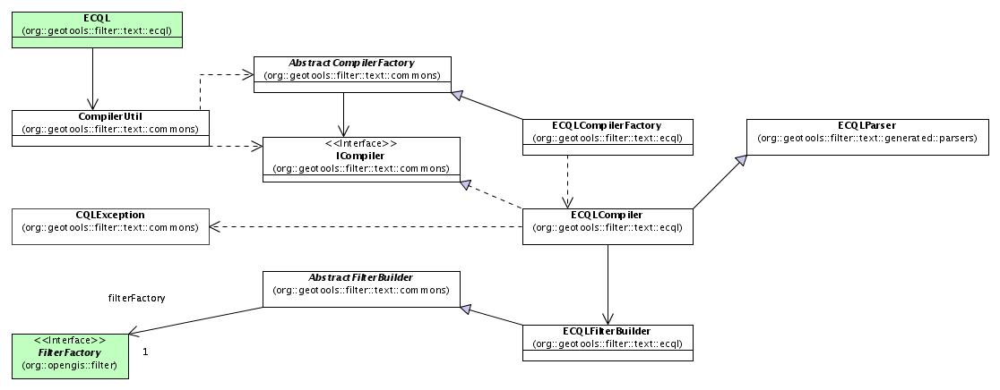

# ECQL Parser Design

This document describes the new query language, called **ECQL**. It is a
CQL Like language which offers a more flexible syntax in order to
support all filter and expression possibilities.

### ECQL Grammar {#ECQLParserDesign-ECQLGrammar}

In this section are presented the ECQL's syntax rules. EBNF metalanguage
is used to describe the grammar.

##### Search conditions

```
    <sequence of search conditions> ::=
                <search condition>
                   |<sequence of search conditions> <semicolon> <search condition>

    <search condition> ::= <boolean value expression>
```

##### Boolean Predicate

```
    <boolean value expression> ::=
        <boolean term>
        | <boolean value expression> OR <boolean term>

    <boolean term> ::=
        <boolean factor>
        | <boolean term> "AND" <boolean factor>

    <boolean factor> ::= [ "NOT" ] <boolean primary>
```

##### Boolean Primary Predicates

```
    <boolean primary> ::=
        <predicate>
        | <left parent> <search condition> <right parent>
        | <left bracket> <search condition> <right bracket>

    <predicate> ::=
        <comparison predicate>
        | <like text predicate>
        | <null predicate>
        | <temporal predicate>
        | <existence_predicate>
        | <between predicate>
        | <id predicate>
        | <spatial predicate>
        | <include exclude predicate>
```

##### Comparison Predicate

```
    <comparison predicate> ::= <expression> <comp op> <expression>

    <comp op> ::= <equals operator>
        | <not equals operator>
        | <less than operator>
        | <greater than operator>
        | <less than or equals operator>
        | <greater than or equals operator>
```

##### Like Text Predicate

```
    <like text predicate> ::= <expression> [ "NOT" ] "LIKE" <character pattern>

    <character pattern> ::= <character string literal>

    (* pattern examples :
            attribute like '%contains_this%'
            attribute like 'begins_with_this%'
            attribute like '%ends_with_this'
            attribute like 'd_ve' will match 'dave' or 'dove'
            attribute not like '%will_not_contain_this%'
            attribute not like 'will_not_begin_with_this%'
            attribute not like '%will_not_end_with_this' *)
```

##### Null Predicate

```
    <null predicate> ::= <expression> "IS" [ "NOT" ] "NULL"
```

##### Existence Predicate

```
    <existence_predicate> :=
          <attribute_name> "EXISTS"
        | <attribute_name> "DOES-NOT-EXIST"
```

##### Between Predicate

```
    <between predicate> ::= <expression> [ "NOT" ] "BETWEEN" <expression> "AND" <expression>
```

##### Temporal Predicate

```
    <temporal predicate> ::=
          <expression> "BEFORE" <date-time expression>
        | <expression> "BEFORE" "OR" "DURING" <period>
        | <expression> "DURING" <period>
        | <expression> "DURING" "OR" "AFTER" <period>
        | <expression> "AFTER" <date-time expression>

    <date-time expression ::= <date-time> | <period>
```

##### ID Predicate

Deprecated Syntax

```
    <id predicate> ::= [ "NOT" ] "IN" "(" <id> {"," <id> } ")"
    <id> ::=  <character string literal>
```

New Syntax (since 2.7.rc1)

```
    <id predicate> ::= [ "NOT" ] "IN" "(" <id> {"," <id> } ")"
    <id> ::=  <character string literal> | <integer literal> 
```

##### IN Predicate

```
    <in predicate>       ::=   <attribute-name> [  "NOT"  ]  "IN"  <in predicate value>
    <in predicate value>    ::=   "(" <in value list> ")"
    <in value list>         ::=   <expression> {"," <expression>}
```

##### INCLUDE/EXCLUDE Predicate

```
    <include exclude predicate> ::= INCLUDE | EXCLUDE
```

##### Expression

```
    <expression> ::= <term> { <addition operator>  <term> } 
                    | <geometry literal>
    <addition operator>::= <plus sign> | <minus sign>

    <term> ::=  <factor> { <multiplication operator> <factor> }
    <multiplication operator> ::= <asterisk> | <solidus>

    <factor> ::=
          <function>
        | <literal>
        | <attribute>
        | ( <expression> )
        | [ <expression> ]

    <function> ::= <identifier> "(" ( <function arguments> ("," <function arguments> )* )? ")"

    <function arguments> ::= <literal> | <attribute> | <expression>

    <literal> ::= <signed numeric literal>| <general literal>

    <signed numeric literal> ::= [ <sign> ] <unsigned numeric literal>

    <general literal> ::=
        <character string literal>
        | <boolean literal>
        | <geography literal

    <boolean literal> ::= "TRUE" | "FALSE" 
```

##### Spatial Predicate

```
    <geometry predicate> ::= <geoop name><georoutine argument list>
        | <expression><relgeoop name><relgeoop argument list>
        | BBOX <bbox argument list>

    <geoop name> ::=   
              EQUALS | DISJOINT | INTERSECTS | TOUCHES | CROSSES 
            | WITHIN | CONTAINS |OVERLAPS | RELATE
    <georoutine argument list> ::=  "(" <expression> "," <expression> ")"

    <relgeoop name> ::= "DWITHIN" | "BEYOND"

    <relgeoop argument list> ::= "(" <expression> "," <expression> "," <tolerance> ")"

    <tolerance> ::=<unsigned numeric literal><comma><distance units>

    <distance units> ::= = "feet" | "meters" | "statute miles" | "nautical miles" | "kilometers"
    
    bbox argument list> ::= "(" <attribute>"," <min X>"," <min Y>"," <max X>"," <max Y> ["," <crs>] ")"
        | "(" <expression>"," <min X>"," <min Y>"," <max X>"," <max Y> ["," <crs>] ")"
            | "(" <expression>"," <expression> ")"

    bbox argument list> ::= "(" <attribute>"," <min X>"," <min Y>"," <max X>"," <max Y> ["," <crs>]")"
        | "(" <expression>"," <min X>"," <min Y>"," <max X>"," <max Y> ["," <crs>] ")"
            | "(" <expression>, <expression> ")"

    <min X> ::= <signed numerical literal>
    <min Y> ::= <signed numerical literal>
    <max X> ::= <signed numerical literal>
    <max Y> ::= <signed numerical literal>
    <crs> ::=  ... (* default: EPSG:4326. *)
```

##### Geometry Literal

```
    <geometry literal> :=
        <Point Tagged Text>
        | <LineString Tagged Text>
        | <Polygon Tagged Text>
        | <MultiPoint Tagged Text>
        | <MultiLineString Tagged Text>
        | <MultiPolygon Tagged Text>
        | <GeometryCollection Tagged Text>
        | <Envelope Tagged Text>

    <Point Tagged Text> ::= POINT <Point Text>

    <LineString Tagged Text> ::= LINESTRING <LineString Text>

    <Polygon Tagged Text> ::= POLYGON <Polygon Text>

    <MultiPoint Tagged Text> ::= MULTIPOINT <Multipoint Text>

    <MultiLineString Tagged Text> ::= MULTILINESTRING <MultiLineString Text>

    <MultiPolygon Tagged Text> ::= MULTIPOLYGON <MultiPolygon Text>

    <GeometryCollection Tagged Text> ::=GEOMETRYCOLLECTION <GeometryCollection Text>

    <Point Text> := EMPTY | <left paren> <Point> <right paren>
    <Point> := <x><space><y>
    <x> := numeric literal
    <y> := numeric literal
    <LineString Text> := EMPTY | <left paren> <Point> \{<comma><Point >\}...<right paren>
    <Polygon Text> := EMPTY | <left paren><LineString Text>\{<comma><LineString Text> \}...<right paren>
    <Multipoint Text> := EMPTY | <left paren><Point Text>\{<comma><Point Text >\}...<right paren>
    <MultiLineString Text> := EMPTY | <left paren><LineString Text>\{<comma><LineString Text>\}...<right paren>
    <MultiPolygon Text> := EMPTY | <left paren><Polygon Text>\{<comma><Polygon Text>\}...<right paren>
    <GeometryCollection Text> := EMPTY | <left paren><Geometry Tagged Text>\{<comma><Geometry Tagged Text>\}...<right paren>
    <Envelope Tagged Text> ::= ENVELOPE <Envelope Text>

    <Envelope Text> ::= EMPTY |
        <left paren><WestBoundLongitude><comma>
            <EastBoundLongitude><comma>
            <NorthBoundLatitude><comma>
            <SouthBoundLatitude>< <right paren>

    <WestBoundLongitude> ::= <numeric literal>
    <EastBoundLongitude> ::= <numeric literal>
    <NorthBoundLatitude> ::= <numeric literal>
    <SouthBoundLatitude> ::= <numeric literal>

    <date-time> ::= <full-date> T <UTC-time>
    <full_date> ::= <date-year> <date-month> <date-day>
    <date-year> ::= <digit><digit><digit><digit>
    <date-month> ::= <digit><digit>
    <date-day> ::= <digit><digit>
    <UTC-time> ::= <time-hour> : <time-minute> : <time-second> Z
    <time-hour> ::= <digit><digit>
    <time-minute> ::= <digit><digit>
    <time-second> ::= <digit><digit>[.<digit>...]
    <duration> ::= P <dur-date> | T<dur-time>
    <dur-date> ::= <dur-day> | <dur-month> | <dur-year> [<dur-time>]
    <dur-day> ::= <digit>... D
    <dur-month> ::= <digit>... M [<dur-day>]
    <dur-year> ::= <didit>... Y [<dur-month>]
    <dur-time> ::= <dir-hour> | <dur-minute> | <dur-second>
    <dur-hour> ::= <digit>... H [<dur-minute>]
    <dur-minute> ::= <digit>... M [<dur-second>]
    <dur-second> ::= <digit>... S
    <period> ::=
        <date-time> / <date-time>
        | <date-time> / <duration>
        | <duration> / <date-time>
```

##### Lexical Rules

```
    <SQL terminal character> ::= <SQL language character>
    <SQL language character> ::= <simple Latin letter>

    | <digit>
    | <SQL special character>
    <simple Latin letter> ::= <simple Latin upper case letter>
                               | <simple Latin lower case letter>
    <simple Latin upper case letter> ::=
           A | B | C | D | E | F | G | H | I | J | K | L | M | N | O
           | P | Q | R | S | T | U | V | W | X | Y | Z
    <simple Latin lower case letter> ::=
           a | b | c | d | e | f | g | h | i | j | k | l | m | n | o
           | p | q | r | s | t | u | v | w | x | y | z
    <digit> ::=
           0 | 1 | 2 | 3 | 4 | 5 | 6 | 7 | 8 | 9

    <SQL special character> ::= <space>
                               | <double quote>
                               | <percent>
                               | <ampersand>
                               | <quote>
                               | <left paren>
                               | <right paren>
                               | <asterisk>
                               | <plus sign>
                               | <comma>
                               | <minus sign>
                               | <period>
                               | <solidus>
                               | <colon>
                               | <semicolon>
                               | <less than operator>
                               | <equals operator>
                               | <greater than operator>
                               | <question mark>
                               | <left bracket>
                               | <right bracket>
                               | <circumflex>
                               | <underscore>
                               | <vertical bar>
                               | <left brace>
                               | <right brace>
    <space> ::= /*space character in character set in use
                  In ASCII it would be 40*/
    <double quote> ::= "
    <percent> ::= %
    <ampersand> ::= &
    <quote> ::= '
    <left paren> ::= (
    <right paren> ::= )
    <asterisk> ::= *
    <plus sign> ::= +
    <comma> ::= ,
    <minus sign> ::= -
    <period> ::= .
    <solidus> ::= /
    <colon> ::= :
    <semicolon> ::= ;
    <less than operator> ::= <
    <equals operator> ::= =
    <greater than operator> ::= >
    <question mark> ::= ?
    <left bracket> ::= [
    <right bracket> ::= ]
    <circumflex> ::= ^
    <underscore> ::= _
    <vertical bar> ::= |
    <left brace> ::={
    <right brace> ::=}
    <separator> ::= { <comment> | <space> | <newline> }...
    /* The next section of the BNF defines the tokens available to the
       language. I have deleted the concepts of bit string, hex string and
       national character string literal. Keywords have been added to support the
       geo literals. */
    <token> ::= <nondelimiter token>
                | <delimiter token>
    <nondelimiter token> ::= <regular identifier>
                            | <key word>
                            | <unsigned numeric literal>

    <regular identifier> ::= <identifier body>
                            | <double quote> {"any character"} <double quote>
    <identifier body> ::= <identifier start> [ { <underscore> | <identifier part> }... ]
    <identifier start> ::= <simple latin letter>
    <identifier part> ::= <identifier start>
                         | <digit>

    <key word> ::= <reserved word>
    <reserved word> ::= NOT | AND | OR | LIKE |
                        IS | NULL |
                        EXISTS | DOES-NOT-EXIST |
                        DURING | AFTER | BEFORE
                        IN | INCLUDE | EXCLUDE |
                        TRUE | FALSE |
                        EQUALS | DISJOINT | INTERSECTS | TOUCHES | CROSSES | WITHIN | CONTAINS| OVERLAPS | RELATE | DWITHIN | BEYOND |
                        POINT | LINESTRING | POLYGON | 
                        MULTIPOINT | MULTILINESTRING | MULTIPOLYGON | GEOMETRYCOLLECTION

    <unsigned numeric literal> ::= <exact numeric literal>
                                  | <approximate numeric literal>
    <exact numeric literal> ::=
                    <unsigned integer> [<period>[<unsigned integer> ] ]
                    | <period> <unsigned integer>
    <unsigned integer> ::= <digit>...
    <approximate numeric literal> ::= <mantissa> E <exponent>
    <mantissa> ::= <exact numeric literal>
    <exponent> ::= <signed integer>
    <signed integer> ::= [ <sign> ] <unsigned integer>
    <sign> ::= <plus sign> | <minus sign>
    <character string literal> ::=
          <quote> [ <character representation>... ] <quote>
    <character representation> ::= <nonquote character> | <quote symbol>
    <quote symbol> ::= <quote><quote>

    /*End of non delimiter tokens*/
    /* I have limited the delimiter tokens by eliminating, interval strings
    and delimited identifiers BNF and simplifying the legal character set to
    the characters to a single set so no identification of character set would
    be needed decision. */

    <delimiter token> ::= <character string literal>
                         | <SQL special character>
                         | <not equals operator>
                         | <greater than or equals operator>
                         | <less than or equals operator>
                         | <concatenation operator>
                         | <double greater than operator>
                         | <right arrow>
                         | <left bracket>
                         | <right bracket>

    <character string literal> ::=
                    <quote> [ <character representation>... ] <quote>
    <character representation> ::= <nonquote character> | <quote symbol>
    <quote symbol> ::= <quote><quote>
    <not equals operator> ::= <>
    <greater than or equals operator> ::= >=
    <less than or equals operator> ::= <=

    /*The following section is intended to give context for identifier and
    namespaces. It assumes that the default namespace is specified in the
    query request and does not allow any overrides of the namepace */
    <identifier> ::=
    <identifier start [ { <colon> | <identifier part> }... ]
    <identifier start> ::= <simple Latin letter>
    <identifier part> ::= <simple Latin letter> | <digit>
    <attribute name> ::= <simple attribute name> | <compound attribute name>
    <simple attribute name> ::= <identifier>
    <compound attribute name> ::= <identifier><period>
                                  [{<identifier><period>}...]
                                  <simple attribute name>

    <integer literal> ::= ...

    <floating literal> ::= ...

    <boolean literal> ::= TRUE | FALSE
```

### ECQL Model

This section presents the UML model which describe the interface and
implementation of ECQL parser.

##### Interface

This diagram presents the package interface. The parser's methods
perform the parsing of ECQL predicates and expressions and builds the
filter.


##### Implementation

Below, the figure shows the principal class of the parser and build
process implementation. ECQLParser does a top down analysis of the input
string and makes the parsing tree. Each time ECQLParser builds a node,
it calls the ECQLCompiler, which implements the semantic actions related
and builds the product or subproduct required to make the Filters and
Expressions at the end of the parsing process.

