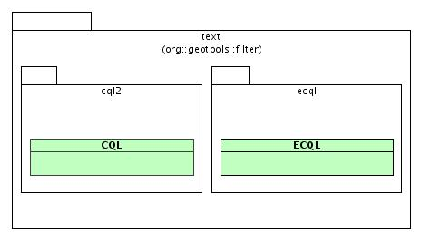
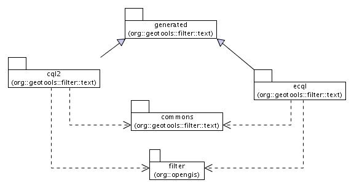

CQL Parser
==========

* User Guide: http://docs.geotools.org/latest/userguide/library/cql/index.html

Resources:

* [CQL Parser Design](CQL.md)
* [ECQL Parser Design](ECQL.md)
* [IP Review](REVIEW.md)

## Status

The module is in good health. No self or transient issues preventing it from compiling and passing tests.

* :star: IP Check: need to ensure all headers are in place
* :star: Releasable: no blocking issues
* :star: Quality Assurance: 84.9% test coverage reported by clover
* :star: Stability: based on reviewed GeoAPI Filter interfaces and reviewed CSW 2.0.1 BNF for CQL
* :star: [user](http://docs.geotools.org/stable/userguide/library/cql/index.html) and design docs. Module maintainer does watches user list, answers email.

## Target

A module dedicated to fully support the OGC Common Query Language, version 2.0.1, as a query predicate language inside GeoTools.

## Motivation

Axios has developed, for the [Gipuzkoa Provincial
Council](http://b5m.gipuzkoa.net), **Mobility and Land Planning
Department**, an implementation of the OGC Catalog Service for Web 2.0.1
specification, based on GeoAPI medatada interfaces and Geotools
implementation to support the ISO-19115/19139 profile.

The [CSW
specification](http://portal.opengeospatial.org/files/?artifact_id=5929&version=2),
in section 6.2.2 defines the complete BNF for a constraint language to
use as query predicates in a CSW implementation, named **OGC Common
Query Language**, CQL for short.

As the CSW implementation worked on useing exclusively
`org.opengis.filter.Filter`, it was needed a converter from an input
query, in **CQL** format, to an equivalent predicate in the form of a
**Filter** object.

## Target Audience

By being part of the GeoTools library, this little module would just
allow for any client code to easily construct a filter using a more
human friendly predicate language.

In particular, the GeoServer community is currently willing to use it to
add friendly filtering capabilities in WMS GetMap requests, and I guess
it could be used in WFS GetFeature too.

An example usage would be:

```
http://server/geoserver/ows?service=WMS&request=GetMap&...&CONSTRAINTLANGUAGE=CQL_TEXT&CONSTRAINT="the_geom bbox(0, 0, 180, 90, 'EPSG:4326')"
```

Of course the quoted text after `CONSTRAINT=` should be properly encoded for HTTP.

## History

The module is derived from the old *ExpressionBuilder* parser by Ian Schneider.

The focus was to fully support the 2.0.1 version of the BNF as defined
in the CSW spec. This implies, among other improvements:

-   support for nested and prefixed property names (for example,
    `gmd:MD_Metadata.identificationInfo.gmd:MD_DataIdentification.abstract`)
-   support for spatial predicates (intersect, touches, etc). Note that
    the BNF oddly suppressed the trailing 's' from these predicates, so
    `TOUCH(ATTR1, POINT(1 2))` instead of `TOUCHES(ATTR1, POINT(1 2))`
-   temporal predicates (BEFORE, AFTER, DURING, etc)

## Design

The diagram presents the cql module **published** interface. The showed
classes, **CQL** and **ECQL**, implement the contract with the clients.
You can find other public classes in packages such as **common** and
**generated**, but they are intended as internal interface (part of the
implementation). They are not part of CQL module contract, so you should
not use those classes.



In the below figure are presented the main package relations. The
**generated** package maintains all classes generated by **javacc**. The
**cql2** and **ecql** packages implement the parsing and filter
construction for OGC CQL and ECQL languages, respectively. In the
**commons** are encapsulated the utility classes required to implement
the module behavior.



To know more about CQL module implementation, see the following links:

* [CQL Parser Design](CQL.md)
* [ECQL Parser Design](ECQL.md)
